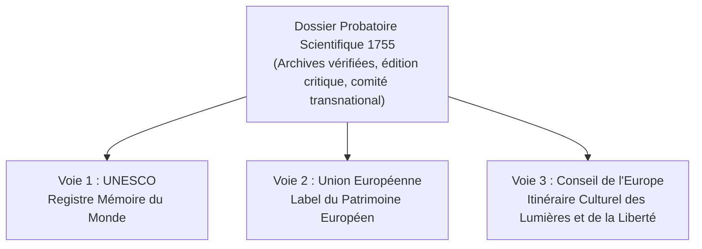

# Annexe 04 — Pistes de reconnaissance internationale et patrimoniale

## 1. Principes d'une stratégie non naïve

Le Projet #1755 ([`research/autonomia/projet_1755.md`](../../research/autonomia/projet_1755.md)) récuse la démarche victimaire ou la pétition politique sans assise scientifique. Pour obtenir une reconnaissance durable de la séquence corse 1729–1755 dans l'histoire universelle de la démocratie, la méthode doit être rigoureusement documentée, transnationale et dépolitisée.

Trois voies de reconnaissance institutionnelle multilatérales sont identifiées :

---

## 2. Voie 1 : UNESCO — Registre de la Mémoire du Monde

Le Registre de la Mémoire du monde (*Memory of the World*) de l'UNESCO est spécifiquement destiné à préserver et valoriser les documents textuels ayant une signification patrimoniale universelle (comme la *Magna Carta* de 1215 ou la *Déclaration des droits de l'homme et du citoyen* de 1789).

### Critères d'éligibilité pour la Constitution de 1755
1. **Importance universelle :** Premier texte constitutionnel écrit proclamant la souveraineté du peuple et instituant la séparation des pouvoirs par suffrage démocratique direct ;
2. **Impact transnational documenté :** Rôle attesté dans les débats des Lumières européennes (Rousseau, Voltaire, Boswell) et dans la genèse de la Révolution américaine (*Sons of Liberty*) ;
3. **Condition matérielle :** Nécessité d'associer les dépôts d'archives français, italiens et britanniques dans une candidature transnationale conjointe.

---

## 3. Voie 2 : Union Européenne — Label du Patrimoine Européen

Le Label du patrimoine européen (*European Heritage Label*) distingue les sites et monuments qui célèbrent et symbolisent les idéaux, les valeurs et l'histoire de l'intégration et de la démocratie européennes.

### Le site de Corte comme berceau constitutionnel
- **Corte, capitale de la Nation corse (1755–1769) :** Le couvent Saint-François (lieu de proclamation de la Constitution), le Palais national (siège du gouvernement paolien et de la chancellerie) et l'Université de Corte constituent un ensemble architectural et mémoriel unique en Méditerranée ;
- **Pédagogie civique :** Le projet muséal associé (Musée Mariani des Possibles) offre le support d'exposition et d'interaction citoyenne attendu par les instances européennes.

---

## 4. Voie 3 : Conseil de l'Europe — Itinéraires culturels transnationaux

Le programme des Itinéraires culturels du Conseil de l'Europe permet de relier des territoires à travers une mémoire partagée de la liberté et des droits civiques.

### Tracé de l'Itinéraire Paolien des Lumières
- **Corse :** Morosaglia (maison natale), Casabianca (Consulte de juillet 1755), Corte (capitale constitutionnelle), Murato (hôtel des monnaies), L'Île-Rousse (port de la liberté), Ponte Novu (mémoire républicaine) ;
- **Italie :** Naples (formation intellectuelle auprès de Genovesi), Livourne (liaisons maritimes), Gênes (archives d'État) ;
- **Royaume-Uni :** Auchinleck et Édimbourg (James Boswell), Londres (Westminster Abbey, monument Paoli, résidences d'exil) ;
- **États-Unis :** Philadelphie (foyer des Sons of Liberty), Paoli (Pennsylvanie, champ de bataille et mémorial).

---

## 5. Feuille de route opérationnelle

1. **Constitution d'un comité scientifique transnational indépendant :** Réunir des historiens et juristes de premier plan spécialistes des révolutions atlantiques (France, Italie, Royaume-Uni, États-Unis) ;
2. **Publication d'un corpus critique en libre accès :** Mise en ligne du texte critique avec fac-similés haute définition (protocole IIIF) ;
3. **Colloque scientifique international à Corte :** Présenter les conclusions probatoires et engager formellement les dépôts de dossiers auprès des commissions nationales et internationales.
