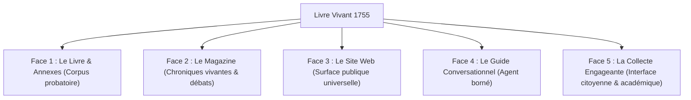

# 1755 — Architecture du Livre Vivant

## 1. Objet et thèse centrale

Le Livre Vivant **1755** a pour objet de documenter, d'analyser et de réintégrer la séquence révolutionnaire et constitutionnelle corse (1729–1755–1769) dans l’histoire mondiale du constitutionnalisme démocratique moderne.

Sa thèse centrale s'énonce ainsi :

> **La Constitution corse adoptée à la Consulte de Corte en novembre 1755 sous la conduite de Pascal Paoli constitue l'un des premiers cas historiques avérés où se sont articulés, dans un texte juridique transformateur écrit, la souveraineté constituante populaire, la séparation des pouvoirs et la désignation des gouvernants par un corps civique universalisé.**

Ce Livre Vivant n'est ni un monument hagiographique insulaire, ni une revendication d'antériorité chauvine. C'est un **dossier probatoire ouvert** soumis à l'évaluation critique des chercheurs, des constitutionnalistes et des citoyens.

---

## 2. L'amont matériel et institutionnel : le lien avec Commons

La rupture constitutionnelle de 1755 ne surgit pas ex nihilo. Elle prend racine dans une crise séculaire de la gouvernance territoriale documentée dans le Livre Vivant **Commons** ([`projects/commons/`](../commons/README.md)) :

1. **La *Terra di Comune* :** Depuis la révolte anti-féodale de Sambucuccio d'Alando (1358), la Corse du Nord-Est (*Cismonte*) vivait sous un régime de communaux étendus (terres collectives, pacages, forêts indivises régies par les assemblées de village).
2. **La faillite des *Nobles Douze* :** L'institution corporatiste génoise des *Nobili Dodici* (*Statuti* de 1571), censée représenter la *Terra di Comune* auprès du Gouverneur génois, s'est transformée en oligarchie cooptée, coupée des communautés locales et complice de l'arbitraire fiscal de la République de Gênes.
3. **Le basculement de 1729 :** Lorsque Gênes tente d'imposer des taxes indues (*quattrino*), les *Nobles Douze* s'avèrent incapables d'arbitrer le conflit. Le peuple contourne cette médiation défaillante, réactive la tradition des *Cunsulte* et entre en révolte.
4. **La refondation de 1755 :** Après vingt-six années de guerre asymétrique et l'expérience éphémère du roi Théodore (1736), Pascal Paoli dépasse l'échelon oligarchique en fondant la *Dieta Generale* élue par tous les chefs de famille, scellant ainsi l'alliance entre démocratie politique et protection des biens communs.

---

## 3. L'architecture des Cinq Faces

Conformément à la grammaire doctrinale du Livre Vivant ([`research/livre_vivant.md`](../../research/livre_vivant.md)), **1755** se déploie sur cinq faces organiques :

### Face 1 : Le Livre (Manuscrit canonique et Annexes probatoires)
- **Le Manuscrit (n1) :** Organisé en 4 mouvements narratifs et analytiques (la rupture de 1729, la Consulte constituante de 1755, le droit écrit transformateur, la circulation atlantique et les résonances contemporaines).
- **Les Annexes probatoires :** Éditions critiques bilingues (italien/français) de la Constitution de 1755, étude probatoire sur les *Nobili Dodici*, inventaire archivistique et cotes des manuscrits, cartographie des reconnaissances internationales (UNESCO, Label européen).

### Face 2 : Le Magazine (Chroniques et controverses vivantes)
- Espace de publications courtes, d'analyses historiographiques pointues et de vulgarisation exigeante :
  - L'énigme du vote des femmes sous Paoli (cheffes de famille et veuves) ;
  - Paoli vu par la presse anglo-saxonne et les *Sons of Liberty* américains ;
  - Le système monétaire et l'imprimerie nationale de Corte.

### Face 3 : Le Site Web (`1755.acorsica.org`)
- Surface statique hypertexte universelle, accessible sans barrière d'accès ni péage, indexable par les moteurs et moissonnable par les modèles d'IA via `llms.txt`.
- Navigation ergonomique entre le manuscrit, les annexes, la chronologie interactive et les sources d'archives.

### Face 4 : L'Agent conversationnel (Guide d'accompagnement borné)
- Guide interactif public embarqué dans le navigateur, régi par un profil strict ([`guide-profile.yml`](guide-profile.yml)) comportant **8 invariants épistémiques indérogeables**.
- Interdiction absolue d'affabulation, respect du niveau de preuve des affirmations et zéro collecte de données personnelles.

### Face 5 : La Surface de collecte engageante
- Dispositif local (côté client) permettant aux lecteurs, archivistes et chercheurs de rédiger des propositions de corrections, des signalements d'archives inédites et des objections contradictoires, exportables au format markdown pour enrichir le corpus.

---

## 4. Grille épistémique et niveaux de preuve

Le Livre Vivant 1755 applique rigoureusement la grille d'imputabilité épistémique définie dans le projet source :

| Niveau | Qualification | Exemples dans le Corpus 1755 |
| :--- | :--- | :--- |
| **Level A** | **Faits établis** | Texte voté de la Constitution de novembre 1755 ; rôle de Paoli ; Consulte de Corte ; témoignage de Boswell (1768) ; projet de Rousseau (1765) ; toponymie américaine (Paoli, PA). |
| **Level A/B** | **Faits à vérifier** | Localisation exacte et cote archivistique définitive du manuscrit autographe de 1755 ; variantes manuscrites ; conditions d'exposition et de numérisation publique. |
| **Level B** | **Interprétations défendables** | Précocité mondiale du constitutionnalisme écrit démocratique moderne ; effectivité du droit de vote accordé aux cheffes de famille ; nature de la séparation des pouvoirs paolienne. |
| **Level C** | **Hypothèses prospectives** | Filiation conceptuelle entre le droit transformateur de Paoli et les principes de l'Autonomie de Capacité et de la Kudocracy contemporaine. |

---

## 5. Principes cardinaux de gouvernance

1. **Friends before competitors :** Reconnaissance et valorisation des travaux universitaires antérieurs (Dorothy Carrington, François-J. Lamotte, Francis Pomponi, Antoine-Marie Graziani, etc.).
2. **Localize knowledge, distribute references :** Ancrage dans les archives territoriales (Bastia, Corte, Gênes, Londres, Paris) sans centralisation hégémonique.
3. **Double temporalité maîtrisée :** Rigueur historienne absolue sur le XVIIIᵉ siècle ; typage clair des extrapolations sur le XXIᵉ siècle.
4. **Souveraineté des lecteurs :** Aucune conservation occulte d'historique de consultation ou de profilage psychologique.
