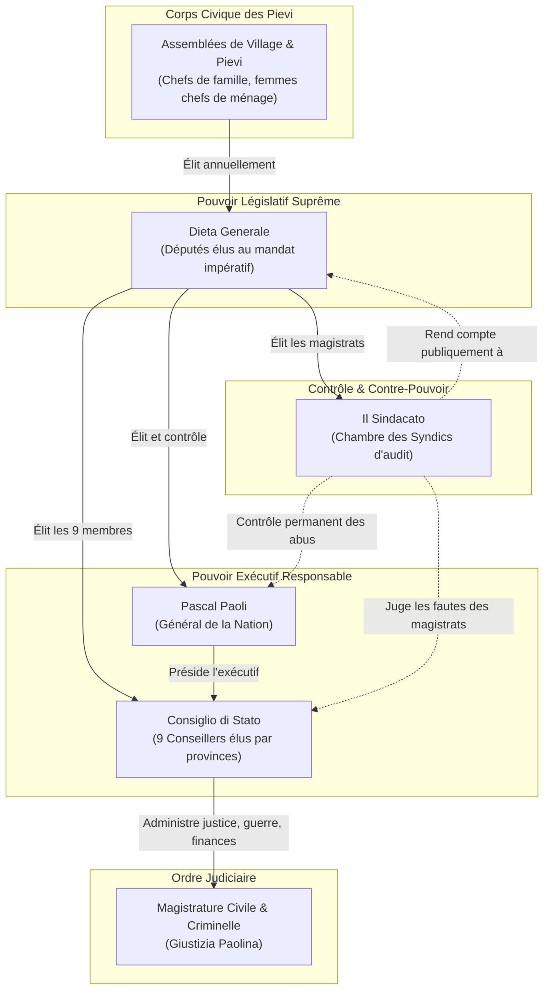

# Chapitre 3 — Le droit écrit transformateur et la séparation des pouvoirs

## 1. La mécanique institutionnelle paolienne

L'architecture institutionnelle instaurée par la Constitution de 1755 ne relève pas d'une utopie théorique : c'est un mécanisme constitutionnel opératoire conçu pour empêcher la résurgence de la tyrannie et le factionnalisme des grandes familles.

### L'exécutif collégial et responsable
Le Général de la Nation n'est pas un monarque absolu. Il est le premier magistrat de la République, élu par la Diète et révocable par elle. Pour éviter la personnalisation du pouvoir, il est assisté du **Consiglio di Stato** (Conseil d'État), composé de neuf conseillers élus représentant les trois grandes provinces (au-delà des monts, en-deçà des monts et la juridiction du centre).
Le Conseil d'État est subdivisé en trois sections opérationnelles :
1. La Justice ;
2. La Guerre ;
3. Les Finances et le Bien public.

### Le Sindacato : l'invention du contre-pouvoir de contrôle
L'une des créations les plus originales de Paoli est le **Sindacato** (la Chambre des Syndics). Composé de magistrats intègres élus par la Diète, le Sindacato est une cour constitutionnelle et administrative avant l'heure.
Tout citoyen lésé par l'arbitraire d'un officier public, d'un juge, d'un collecteur d'impôt ou même d'un ordre du Général peut saisir le Sindacato. L'institution dispose du pouvoir de suspendre les officiers corrompus, d'annuler les décisions arbitraires et de faire comparaître les magistrats devant la Diète.

## 2. La « Giustizia Paolina » et l'extinction des vendettas

L'un des plus grands défis de l'État naissant était d'enrayer les guerres privées (*faide* et *vendette*) qui décimaient les familles corses, souvent entretenues par l'administration génoise selon l'adage « Diviser pour régner ».

Paoli comprend que la paix civile ne peut s'imposer par la seule terreur militaire. Elle exige la **légitimité du droit écrit transformateur** :
- La loi érige la vendetta en crime contre la Nation. Tout individu se vengeant lui-même encourt la peine capitale et l'infamie publique (« colonna d'infamia ») ;
- L'institution des juges de paix itinérants et le serment solennel de pardon (*paci*) sous l'égide de la République ;
- En rendant la justice publique rapide, gratuite et équitable, l'État paolien ôte aux clans leur justification d'auto-défense armée. En quelques années, le nombre d'homicides est divisé par dix.

## 3. Les piliers matériels et cognitifs de la souveraineté

La liberté politique demeure une coquille vide si elle ne s'accompagne pas d'une autonomie matérielle et intellectuelle. En moins d'une décennie, le gouvernement de Corte édifie les piliers d'un État complet :

1. **L'Université de Corte (fondée en 1765) :** Pour ne plus dépendre des universités italiennes et former les cadres civils et juridiques de la République, Paoli ouvre une université publique, gratuite pour tous les Corses. On y enseigne le droit public, la théologie, les mathématiques, la physique expérimentale, l'histoire et la philosophie morale.
2. **L'Imprimerie nationale et la presse :** L'imprimerie d'État de Corte publie les lois, les édits constitutionnels et le journal officiel de la République, les *Ragguagli dell'Isola di Corsica*, premier organe de presse libre de l'île informant les citoyens et les chancelleries étrangères.
3. **La monnaie nationale :** Paoli installe un atelier monétaire à Murato. La monnaie corse (testoni, soldi, denari) est frappée aux armes de la Nation : la tête de Maure, dépouillée de son bandeau d'esclave sur les yeux et ceinte du bandeau sur le front, symbole de lucidité et d'affranchissement.
4. **La flotte marchande et la fondation d'Île-Rousse :** Pour briser le blocus naval génois centré sur Calvi et Algajola, Paoli fait construire un port franc fortifié sur les rochers rouges du littoral balanin : *Isola Rossa* (L'Île-Rousse), dotée de chantiers navals et d'une marine marchande battant pavillon à la tête de Maure.
