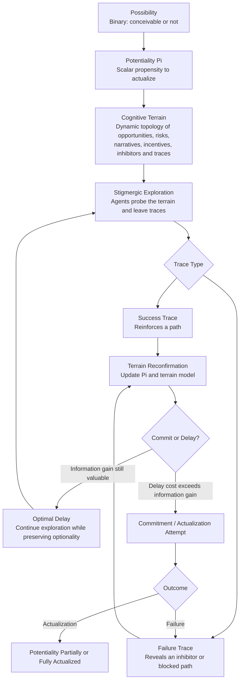
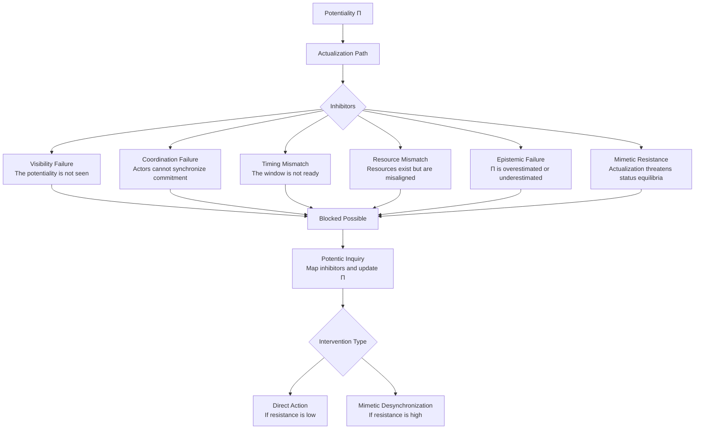
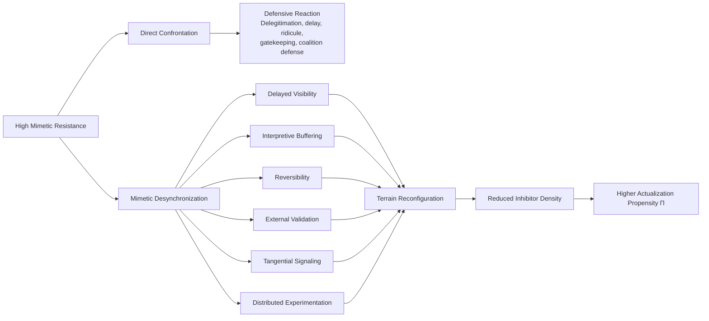

# Sailing the Cognitive Waves  
## A Stigmergic Cognitive-Terrain Framework for Adaptive Exploration under Mimetic Constraints

**Jean Hugues Noël Robert, baron Mariani**  
Institut Mariani / C.O.R.S.I.C.A.  
1 cours Paoli, F-20250 Corte, Corsica, France  
jhr@baronsmariani.org  

*Working paper — May 2026*

---

## Short Version

This paper proposes that complex strategy should not be understood as the execution of a fixed plan, but as adaptive navigation through dynamic cognitive terrains.

A cognitive terrain is the moving topology of perceived opportunities, risks, incentives, narratives, legitimacy gradients, inhibitors, and traces that shapes what agents believe can actually be done.

The framework is situated within *Potentics*, the proposed science of potentialities. Potentics distinguishes between a **possibility**, which is binary, and a **potentiality**, which is scalar: the propensity of a possible state to actualize under given conditions, effort, and inhibitors.

The central mechanism proposed here is **stigmergy**. Agents explore the terrain and leave traces. Successes reinforce possible paths. Failures reveal blocked paths, hidden inhibitors, timing errors, or misread potentialities. Documented failure is therefore not waste: it is a terrain update.

The paper also introduces the **Optimal Delay Principle**: commitment should be delayed until the expected informational gain from further exploration becomes lower than the expected cost of continued delay. This preserves optionality without confusing delay with passivity.

A major obstacle to actualization is **mimetic resistance**: rivalry, status preservation, institutional gatekeeping, envy, and resistance to reclassification. In such environments, direct confrontation often strengthens the blockage.

The proposed strategy is **mimetic desynchronization**: indirect terrain reconfiguration through delayed visibility, interpretive buffering, reversibility, external validation, tangential signaling, and distributed experimentation.

The goal is not to impose a plan, but to increase the probability that real potentialities become actualized by reading, testing, and reshaping the terrain in which they must emerge.

---

## Note to the Reader

This paper intentionally adopts a partially performative structure. Its organization reflects several of the mechanisms it describes: delayed exposition, triangulation of perspectives, and progressive terrain reconfirmation.

The title *Sailing the Cognitive Waves* is intended as a discreet homage to John Brunner’s *The Shockwave Rider* (1975). Brunner imagined a figure surviving informational turbulence by riding the shockwave rather than stopping it. This paper develops a related intuition: in complex cognitive terrains, adaptive agents must learn to read, ride, and sometimes redirect the waves.

The reader is invited to focus primarily on the operational usefulness and coherence of the framework rather than on strict disciplinary conventions. The present text is proposed as an exploratory synthesis and an open research program rather than a finalized theory.

---

## Abstract

This paper proposes a stigmergic cognitive-terrain framework for adaptive exploration under uncertainty and mimetic resistance. It extends *Potentics* — the proposed science of potentialities — by examining how agents may navigate the moving terrains in which possibilities become more or less likely to actualize.

A cognitive terrain is defined as the dynamic topology of perceived opportunities, risks, narratives, legitimacy gradients, inhibitors, and traces shaping action. In such terrains, strategy cannot be reduced to the execution of a fixed plan. It requires continuous terrain reconfirmation.

The paper identifies stigmergy as the core mechanism of this process. Agents explore, leave traces, learn from success and failure, and progressively update the terrain. Documented failure is treated not as waste, but as epistemic yield: it reveals inhibitors, timing errors, false assumptions, or blocked paths.

The paper further introduces the Optimal Delay Principle, according to which commitment should be delayed until the expected informational gain from further exploration falls below the cost of continued delay. It also analyzes mimetic inhibitors — rivalry, status preservation, institutional gatekeeping, envy, and resistance to reclassification — as major obstacles to actualization.

Finally, it proposes mimetic desynchronization as an indirect strategy for terrain reconfiguration through delayed visibility, interpretive buffering, reversibility, external validation, tangential signaling, and distributed experimentation.

Applications include startup strategy, territorial development, distributed infrastructure, governance, and AI-assisted exploration systems.

---

## Introduction  
### Complexity and the Failure of Static Plans

Modern societies increasingly operate under conditions of radical complexity:

- accelerated technological change;
- informational saturation;
- institutional interdependence;
- reflexive social feedback loops;
- ecological and energetic constraints;
- geopolitical and cognitive instability.

Paradoxically, these conditions generate a renewed demand for planning. The more complex the world becomes, the stronger the psychological and institutional desire for certainty, prediction, synchronization, and centralized optimization.

This demand is visible in contemporary forms of techno-planning:

- predictive governance;
- algorithmic decision systems;
- centralized AI coordination;
- institutional metricization;
- bureaucratic strategy frameworks;
- industrial and territorial planning programs.

Yet complex adaptive environments are precisely those in which fixed plans become least reliable.

A static plan assumes that the terrain is sufficiently stable to be mapped in advance. But in complex systems, the terrain changes continuously. Worse: the act of navigation itself modifies the terrain. Agents react to predictions, institutions adapt to incentives, rivals respond to signals, and narratives reshape what appears possible.

The central claim of this paper is therefore simple:

> In dynamic cognitive terrains, robust strategy depends less on executing a precomputed plan than on continuously reconfirming the terrain and adapting flows of action accordingly.

This does not imply chaos, improvisation without discipline, or rejection of rationality. On the contrary, it requires a more demanding form of rationality: one that treats action, perception, and learning as co-produced.

The paper proposes such a framework under the name:

> **stigmergic cognitive-terrain navigation**.

Its purpose is to describe how agents can explore and actualize potentialities when the relevant terrain is uncertain, moving, contested, and resistant.

---

## Contributions

This paper makes four main contributions.

First, it introduces the concept of **cognitive terrain** as a dynamic topology of perceived opportunities, risks, legitimacy gradients, narratives, inhibitors, and traces shaping the actualization of potentialities.

Second, it proposes **stigmergy** as the core mechanism through which agents explore such terrains, preserve useful failures, and progressively reconfirm what can actually be done.

Third, it identifies **mimetic inhibitors** — rivalry, status preservation, institutional gatekeeping, and resistance to reclassification — as central forces preventing the actualization of valuable potentialities.

Fourth, it proposes **mimetic desynchronization** as a strategy of indirect terrain reconfiguration, allowing agents to reduce resistance without triggering premature defensive reactions.

Together, these contributions extend Potentics from a general science of potentialities toward an operational theory of adaptive navigation under uncertainty.

---

## Terminology

This paper uses several terms in a specific sense.

- **Possibility**: a conceivable state of affairs.
- **Potentiality**: the scalar propensity of a possibility to actualize under given conditions, effort, and inhibitors.
- **Cognitive terrain**: the dynamic topology of perceived opportunities, risks, narratives, legitimacy gradients, constraints, and traces shaping action.
- **Trace**: any persistent mark left by action that modifies future navigation, including documented failures.
- **Terrain reconfirmation**: the continuous updating of the perceived terrain through signals, traces, experiments, and feedback.
- **Mimetic inhibitor**: a social force that blocks actualization because the potentiality threatens status, rivalry structures, or inherited classifications.
- **Mimetic desynchronization**: indirect terrain reconfiguration designed to reduce resistance without triggering premature defensive reactions.

---

## Potentics as the General Framework

### Conceptual Flow

This paper builds on *Potentics*, defined as the rational exploration of the possible. The foundational formulation is available in Robert (2026), *What is Potentics? Toward a Science of the Possible*.

Potentics begins from a distinction between possibility and potentiality:

- a **possibility** is binary: something is either conceivable or not;
- a **potentiality** is scalar: it measures the propensity of a possible state to actualize under given conditions and available effort.

In this view, the relevant question is not merely:

> Is this possible?

but rather:

> What is the real propensity of this possibility to actualize, what inhibits it, and what effort would be required to cultivate it?

Potentics proposes that potentiality can be provisionally analyzed through several dimensions:

- **propensity** — intrinsic tendency to actualize;
- **effort** — resources required;
- **value** — worth if actualized;
- **reversibility** — degree to which actualization can be undone;
- **inhibitors** — structural, cognitive, social, or institutional factors preventing actualization.

It also introduces the concept of epistemic metapotentiality:

> the value of knowing whether a potentiality is real and worth pursuing.

This is crucial because, in uncertain environments, the value of exploration may exceed the immediate value of action. A failed experiment, if properly documented, can be as epistemically valuable as a success.

The present paper can be understood as a dynamic and operational extension of Potentics.

Potentics asks:

> What could become real, under what conditions, and through which inhibitors?

This paper asks:

> How can agents navigate moving cognitive terrains in order to discover, test, and actualize potentialities under real-world constraints?

---

## The Return of Planning in the Age of Complexity

The need for such a framework becomes clearer when one examines the contemporary return of planning under conditions where planning is least reliable.

The twentieth century appeared to discredit centralized planning. The collapse of Soviet-style command economies exposed the structural limits of systems attempting to replace distributed adaptation with centralized computation.

Friedrich Hayek emphasized the dispersed nature of knowledge in society. Herbert Simon showed the limits of rationality under complexity. James C. Scott demonstrated how state simplification often destroys the local intelligence embedded in practices, customs, and informal systems.

Yet planning has returned.

Not necessarily as explicit command economy, but as:

- predictive analytics;
- algorithmic administration;
- centralized institutional dashboards;
- large-scale technocratic programs;
- AI-assisted optimization;
- governance by metrics.

This return is not accidental. Complexity produces anxiety, and anxiety produces demand for legibility.

However, legibility is not the same as reality.

A system can become highly legible while becoming less adaptive. It can optimize its internal metrics while losing contact with the real terrain. It can stabilize a local maximum while blocking superior but more disruptive potentialities.

This is the **local maxima trap**:

> a system becomes stable, coherent, and defensible within its own internal logic, while remaining globally under-adaptive.

The problem is not planning as such. The problem is treating a plan as if it were the terrain.

---

## Cognitive Terrain  
### From Maps to Waves

A cognitive terrain is defined here as:

> a dynamically evolving topology of perceived opportunities, risks, incentives, narratives, constraints, legitimacy gradients, and social signals influencing adaptive decision flows.

It is not a physical map, though it may include physical constraints. It is not merely a subjective representation, though it depends on perception. It is the practical terrain through which agents actually navigate when deciding what is worth doing, what is possible, what is dangerous, what is legitimate, and what is likely to succeed.

A cognitive terrain includes:

- material constraints;
- institutional rules;
- informal norms;
- rivalries and alliances;
- narratives and taboos;
- available resources;
- perceived legitimacy;
- memory of past attempts;
- social costs of success or failure.

Unlike a static map, a cognitive terrain behaves more like an ocean of moving waves.

The waves represent shifting gradients of:

- opportunity;
- risk;
- attention;
- resistance;
- legitimacy;
- coordination;
- inhibition.

Agents do not simply move across this terrain. They also modify it.

A public statement can alter legitimacy.  
A prototype can alter credibility.  
A failed attempt can mark a dead end.  
A successful small experiment can create a new attractor.  
An external validation can shift the perceived status of a local actor.  
A narrative can make a previously invisible potentiality thinkable.

Thus strategy becomes recursive:

> agents navigate the terrain while also contributing to its reconfiguration.

---

## Stigmergy as the Core Mechanism  
### Distributed Memory of Successes and Failures

The central operational mechanism of the framework is **stigmergy**.

Originally introduced by Pierre-Paul Grassé in the study of social insects, stigmergy describes a form of coordination in which agents act indirectly through traces left in the environment.

Ants, for example, do not require a central planner to find efficient paths. They explore. Their traces modify the environment. Successful paths are reinforced. Unsuccessful paths decay.

This produces adaptive coordination through environmental memory.

In the present framework, stigmergy is generalized beyond insects.

A stigmergic trace may be:

- a trail;
- a prototype;
- a public narrative;
- a documented failure;
- a legal precedent;
- a technical repository;
- an institutional workaround;
- a failed collaboration;
- a successful pilot;
- a visible artifact;
- an external validation.

The key point is that traces modify future navigation.

They change what other agents perceive as:

- possible;
- costly;
- legitimate;
- risky;
- worth attempting;
- already tested.

Stigmergy therefore provides a mechanism for terrain reconfirmation.

It allows agents to learn from the terrain without requiring a complete central model of it.

---

## The Epistemic Value of Failure

A major weakness of many formal knowledge systems is that they preserve success more effectively than failure.

Academic publication systems tend to reward positive results, polished conclusions, and successful demonstrations. Yet in adaptive exploration, failed attempts are often as informative as successes.

A failure can reveal:

- an invisible inhibitor;
- a false assumption;
- a missing resource;
- a social resistance point;
- a timing error;
- a coordination failure;
- an overestimated potentiality;
- an underestimated cost of actualization.

In Potentics, documented failure has epistemic value because it updates the estimate of a potentiality.

A failed exploration does not merely say:

> this did not work.

It may say:

> this potentiality is real but inhibited;
> this path is blocked;
> this timing is premature;
> this coalition is unstable;
> this terrain has been misread.

Stigmergy gives failure a durable role.

The failure becomes a trace.

The trace modifies future exploration.

This is why adaptive systems should not merely celebrate success. They should encode useful failure.

---

## The Optimal Delay Principle  
### Acting at the Last Responsible Moment

In moving terrains, premature commitment can be destructive.

A potentiality may be real but not yet ready.  
The terrain may not yet support actualization.  
The relevant gradients may still be unclear.  
Mimetic resistance may be too intense.  
The cost of visibility may exceed the benefit of action.

This paper proposes the **Optimal Delay Principle**:

> Commitment should be delayed until the expected marginal informational gain from further exploration becomes lower than the expected cost of continued delay.

This is not passivity.

During optimal delay, the agent continues to:

- observe;
- test;
- signal;
- prototype;
- gather traces;
- preserve optionality;
- reduce uncertainty;
- increase terrain resolution.

The principle is close to:

- real options theory;
- agile development;
- lean startup;
- active inference;
- military reconnaissance;
- navigation under uncertainty.

Its practical logic is simple:

> do not cross the irreversible threshold before the terrain has provided enough signals to justify the commitment.

This connects directly with reversibility.

The more irreversible an action is, the more valuable delay may become — provided delay is used for exploration rather than avoidance.

A high-potentiality future may be ineluctable without being immediate.

This distinction matters. A possibility may be structurally strong, yet blocked by timing, legitimacy, resources, or mimetic resistance. Acting too early can destroy or discredit it before the terrain is ready.

---

## Mimetic Inhibitors  
### When Potentialities Threaten Local Equilibria

Many potentialities fail not because they lack value, but because their actualization threatens existing equilibria.

This is especially true in social, institutional, and territorial systems.

A new potentiality may threaten:

- status hierarchies;
- rent positions;
- symbolic authority;
- institutional monopolies;
- established narratives;
- professional identities;
- local reputations;
- inherited rivalries.

In such cases, resistance to change is not merely psychological. It is structural.

A system may collectively underperform because too much energy is spent preventing relative losses rather than producing shared gains.

This is worse than a simple winner-loser dynamic. In certain environments, actors may prefer that no one wins rather than allow a rival to gain visible advantage.

This produces a high-friction terrain.

The apparent result is often called:

> immobilism.

But “immobilism” is only a surface description. It says that nothing moves. It does not explain why.

In this framework, immobilism is interpreted as:

> the visible effect of energy dissipated through mimetic rivalry, anti-coordination, and resistance to reclassification.

The problem is not necessarily lack of competence.  
Nor necessarily lack of resources.  
Nor necessarily lack of ideas.

It may be a defective topology of cooperation.

---

## Mimetic Desynchronization  
### Indirect Reconfiguration of Hostile Terrains

When terrain resistance is high, direct confrontation often fails.

It may even strengthen the resistance.

An institution or local system that perceives a new potentiality as a threat may respond through:

- disqualification;
- ridicule;
- bureaucratic delay;
- symbolic marginalization;
- coalition defense;
- refusal of recognition;
- capture of validation channels.

Under such conditions, strategy must shift.

The objective is no longer to win directly inside the hostile terrain.

The objective becomes:

> to reconfigure the terrain so that resistance becomes less efficient and cooperation becomes more attractive.

This paper calls this strategy **mimetic desynchronization**.

It includes several tactics:

### Delayed visibility

Do not reveal the full strategic pattern before the terrain is ready to interpret it productively.

### Interpretive buffering

Present a project under a low-threat interpretation until its practical value becomes visible.

### Reversibility

Design actions so that they appear experimental, low-risk, and reversible.

### Institutional pre-legitimation

Seek recognition from external or higher-level structures before confronting local gatekeepers.

### Tangential signaling

Avoid frontal attacks on dominant narratives; introduce alternative gradients indirectly.

### Distributed experimentation

Multiply small probes instead of concentrating all effort into one visible decisive confrontation.

The purpose is not manipulation in the crude sense. It is adaptive navigation under conditions where direct expression of a potentiality would trigger premature defensive reactions.

In hydrodynamic terms:

> do not attack the dam at its strongest point; find the gradients through which the terrain can be reshaped.

---

## External Validation as Terrain Displacement

In dense local systems, proximity can inhibit recognition.

A person or project may be trapped in an inherited local classification. The local terrain “knows” the actor too well, but often through obsolete categories.

This explains the proverb:

> no one is a prophet in his own country.

In cognitive-terrain terms:

> the closer the social system, the higher the cost of reclassifying a known actor.

External validation can therefore function not as vanity, but as strategic terrain displacement.

It changes the reference frame.

The conflict is no longer:

> local actor versus local hierarchy.

It becomes:

> local hierarchy versus externally validated potentiality.

This does not guarantee success. Local systems can still resist, ignore, or ridicule external validation. But credible external recognition modifies the gradients of legitimacy.

It may reduce inhibitor density.

It may increase the cost of dismissal.

It may create new alliances.

It may make cooperation less threatening than obstruction.

Thus, in Potentic terms:

> external validation can increase the propensity of a potentiality to actualize by modifying its cognitive and institutional terrain.

---

## Triangulation  
### Four Perspectives on the Same Terrain

The framework is deliberately triangulated.

It combines four perspectives:

| Perspective | Function |
|---|---|
| Hydrodynamic | models action as flow through moving gradients |
| Stigmergic | explains distributed memory and trace-based coordination |
| Navigational | emphasizes limited energy, incomplete information, and “à vue” adaptation |
| Mimetic | explains rivalry, resistance, synchronization, and status inhibition |

None of these perspectives is sufficient alone.

Hydrodynamics without stigmergy risks becoming metaphorical.

Stigmergy without mimetic analysis may underestimate social resistance.

Mimetic analysis without navigation risks fatalism.

Navigation without Potentics lacks a theory of what is being explored.

Together, they form a framework for:

> adaptive actualization of potentialities under dynamic and resistant conditions.

---

## Startup Strategy  
### Terrain Reading as Competitive Advantage

Startups operate in uncertain terrains.

Their formal plans are often fragile because the market, technology, financing environment, regulatory context, and user expectations evolve during the process of execution.

The central startup capability is therefore not merely execution of a plan.

It is:

> superior terrain reconfirmation capacity.

A startup must continuously ask:

- What potentiality are we testing?
- What evidence updates our estimate of it?
- Which failures are informative?
- Which signals are noise?
- Which commitments are premature?
- Which path preserves optionality?
- Which narrative modifies the terrain constructively?

In this framework, pivots are not necessarily signs of failure. They are stigmergic corrections.

A pivot says:

> this trace has updated our reading of the terrain.

Startup valuation can also be understood through this lens.

Investors do not merely value present assets. They value perceived future potentialities. Narratives, prototypes, team credibility, timing, and external validation all modify the cognitive terrain in which valuation occurs.

Thus:

> valuation is partly a cognitive-terrain phenomenon.

A strong startup narrative does not simply “sell” the company. It modifies the gradients through which capital, talent, partnerships, and legitimacy flow.

This must be handled carefully. A narrative detached from reality becomes hype. But a narrative that correctly reveals a real potentiality can accelerate actualization.

---

## Governance and Territorial Development  
### From Immobilism to Cooperative Gradients

Territorial development often fails despite the existence of resources, competencies, and opportunities.

The problem may not be absence of potential.

It may be:

> poor coupling of human energies.

A territory may contain:

- talent;
- youth;
- natural resources;
- institutions;
- cultural capital;
- infrastructure;
- identity;
- available spaces;
- unmet needs.

Yet these may fail to combine because the terrain is dominated by:

- rivalry;
- rent capture;
- low trust;
- institutional silos;
- symbolic conflict;
- fear of relative loss;
- absence of shared traces of success.

A governance strategy based on cognitive-terrain navigation would not begin with a grand plan.

It would begin with small cooperative gradients:

- reversible prototypes;
- shared tools;
- local experiments;
- visible wins;
- documented failures;
- public trace systems;
- lightweight institutions;
- external validation loops.

The goal is not to force cooperation morally.

It is to make cooperation easier, more visible, and more rewarding than obstruction.

In stigmergic terms:

> create traces that make future cooperation more probable.

---

## Distributed Infrastructure and Energy Systems

Distributed infrastructures are natural domains for this framework.

Energy systems, in particular, increasingly face:

- intermittent production;
- storage constraints;
- grid congestion;
- territorial inequalities;
- sovereignty concerns;
- institutional resistance;
- mismatch between local resources and centralized architectures.

Energy Packet Networks and store-and-forward architectures can be interpreted as infrastructural analogues of stigmergic navigation.

Instead of relying exclusively on centralized real-time balancing, distributed systems can:

- store;
- route;
- buffer;
- reconfirm demand;
- adapt locally;
- preserve optionality;
- exploit heterogeneous resources.

The analogy is not exact, but structurally useful.

A distributed energy system must read its terrain:

- solar potential;
- storage availability;
- demand patterns;
- regulatory constraints;
- local acceptance;
- infrastructure bottlenecks;
- economic gradients.

Here again, the issue is not merely technical feasibility. It is actualization under inhibitors.

---

## AI-Assisted Exploration Systems

AI systems may become powerful tools for cognitive-terrain navigation.

However, if designed as centralized optimization engines, they may reproduce the weaknesses of planning:

- overconfidence;
- metric fixation;
- synchronization;
- loss of diversity;
- brittle recommendations;
- premature convergence.

A stigmergic AI architecture would instead support:

- distributed hypothesis tracking;
- memory of failed explorations;
- uncertainty mapping;
- inhibitor detection;
- scenario branching;
- terrain reconfirmation;
- preservation of alternative paths.

Such systems would not merely answer:

> What is the best plan?

They would help ask:

> Which potentialities are being explored?
> Which traces update them?
> Which inhibitors are visible?
> Which commitments should be delayed?
> Which gradients are changing?

This suggests a possible role for AI as:

> a cognitive terrain instrument.

Not a sovereign planner, but a tool for augmenting adaptive exploration.

---

## Toward Metrics

The framework remains exploratory, but several candidate metrics can be proposed.

### Terrain Reconfirmation Capacity — TRC

The capacity of a system to update its representation of the terrain through new signals, traces, and feedback.

High TRC implies:

- fast learning;
- low denial;
- strong feedback loops;
- memory of failures;
- willingness to revise maps.

### Exploratory Diversity — ED

The diversity of active probes, hypotheses, pathways, and experimental attempts.

High ED prevents premature convergence.

### Reversibility — R

The degree to which actions can be undone or redirected without catastrophic cost.

High reversibility increases the rationality of experimentation.

### Topological Guidance — TG

The capacity to modify gradients indirectly, making desirable trajectories easier without coercive control.

### Potentiality — Π

The estimated propensity of a possibility to actualize under given conditions and effort.

### Epistemic Metapotentiality — Πₑ

The value of investigating whether Π is real and of the hoped-for magnitude.

These metrics are not yet formalized. They are proposed as scaffolding for future work.

---

## Performative Validation

This text partially performs what it describes.

It proceeds by:

- triangulation;
- indirect exposition;
- conceptual trace-building;
- progressive clarification;
- delayed formalization;
- and integration of failures, frictions, and external feedback.

This does not prove the framework.

A performative structure is not a substitute for empirical validation.

However, it can demonstrate operational consistency.

If the framework helps readers:

- identify inhibitors;
- better distinguish possibility from potentiality;
- preserve useful optionality;
- reinterpret failure as information;
- or navigate complex terrains more effectively,

then it has begun to generate the kind of utility it claims to describe.

---

## Conclusion

The contemporary return of planning reflects a real need: the need for orientation under complexity.

But static plans fail when the terrain itself is moving.

This paper has proposed a different approach: stigmergic navigation in dynamic cognitive terrains.

The core claims are:

1. Potentialities actualize within terrains, not in abstraction.
2. Cognitive terrains are dynamic, socially shaped, and partially hostile.
3. Stigmergy provides distributed memory of both success and failure.
4. Optimal delay preserves optionality until sufficient terrain resolution is obtained.
5. Mimetic inhibitors often block actualization even when value is real.
6. Desynchronization and indirect terrain reconfiguration may outperform frontal confrontation.
7. Adaptive systems should optimize not for certainty, but for terrain reconfirmation capacity.

The framework remains incomplete.

It is not a doctrine, but a research program.

Its validity will depend on whether it proves useful in real terrains: startups, institutions, territories, infrastructures, and AI-assisted exploration systems.

---

## Limits

The framework proposed here is exploratory.

It does not claim that all strategy can be reduced to stigmergy, nor that hydrodynamic metaphors provide scientific proof. The framework is intended as a navigational model: useful if it improves orientation, inhibitor detection, and adaptive exploration in complex terrains.

Several limits remain.

First, the proposed metrics are not yet operationally formalized.

Second, mimetic inhibitors are difficult to measure and may be over-attributed if the framework is applied carelessly.

Third, external validation may reconfigure a terrain, but it can also be ignored, resisted, or reinterpreted by the local system.

Fourth, delayed commitment is useful only if delay is actively used for exploration. Delay without exploration is avoidance.

Finally, the framework must remain subject to the primacy of the real: it should be judged by whether it helps actual agents navigate actual terrains more effectively.

---

## Continuation

Several directions remain open.

First, the relationship between this framework and Potentics should be formalized more precisely. The present paper treats stigmergic cognitive-terrain navigation as an operational method for exploring and actualizing potentialities, but the exact mathematical relation between Π, Πₑ, inhibitor density, and terrain reconfirmation capacity remains unresolved.

Second, the proposed metrics — TRC, ED, R, TG, Π, and Πₑ — require operational definitions. They should be tested first in low-risk domains where traces are observable: startup pivots, open-source repositories, territorial pilots, adaptive governance experiments, or multi-agent simulations.

Third, mimetic inhibitors require deeper analysis. Rivalry, envy, status preservation, institutional capture, and symbolic delegitimation may need to be treated not as secondary social frictions, but as primary forces shaping the actualization landscape.

Fourth, the role of external validation deserves specific study. In dense local systems, external recognition may function as a terrain-displacement mechanism, reducing local inhibitor density and making previously blocked potentialities more actualizable.

Fifth, AI-assisted tools could be developed to support this framework: systems capable of recording traces, mapping inhibitors, detecting repeated failures, preserving exploratory diversity, and estimating the value of further investigation before commitment.

The framework should therefore continue as an iterative research program.

Each application should be treated as a designed exploration.

Each failure should be documented.

Each success should be interpreted not as proof, but as a trace.

The central question remains:

> How can real potentialities be discovered, cultivated, and actualized in terrains that move, resist, and remember?

---

## Preliminary References

Abraham, A., Grosan, C., & Ramos, V. (Eds.). (2006). *Stigmergic Optimization*. Springer.

Alajami, A. A., Moreno, G., & Pous, R. (2022). Design of a UAV for autonomous RFID-based dynamic inventories using stigmergy for mapless indoor environments. *Drones, 6*(8), 208.

Christensen, C. M. (1997). *The Innovator’s Dilemma*. Harvard Business School Press.

Correia, L., Sebastião, A. M., & Santana, P. (2016). On the role of stigmergy in cognition. *Progress in Artificial Intelligence, 6*(1), 79–86.

Dixit, A. K., & Pindyck, R. S. (1994). *Investment under Uncertainty*. Princeton University Press.

Fehr, E., & Gächter, S. (2002). Altruistic punishment in humans. *Nature, 415*, 137–140.

Friedman, D., Tschantz, A., Ramstead, M. J. D., Friston, K., & Constant, A. (2021). Active inferants: An active inference framework for ant colony behavior. *Frontiers in Behavioral Neuroscience, 15*.

Girard, R. (1961). *Mensonge romantique et vérité romanesque*. Grasset.

Grassé, P.-P. (1959). La reconstruction du nid et les coordinations interindividuelles chez Bellicositermes natalensis et Cubitermes sp. *Insectes Sociaux, 6*, 41–80.

Hayek, F. A. (1945). The use of knowledge in society. *American Economic Review, 35*(4), 519–530.

Holland, J. H. (1995). *Hidden Order: How Adaptation Builds Complexity*. Addison-Wesley.

Kauffman, S. (1995). *At Home in the Universe*. Oxford University Press.

Mamei, M., & Zambonelli, F. (2008). Field-based coordination for pervasive computing applications.

Marsh, L., & Onof, C. (2008). Stigmergic epistemology, stigmergic cognition. *Cognitive Systems Research, 9*(1–2), 136–149.

Mintzberg, H. (1994). *The Rise and Fall of Strategic Planning*. Free Press.

Mulvenna, M., Zambonelli, F., Curran, K., & Nugent, C. (2006). Knowledge networks.

Ostrom, E. (1990). *Governing the Commons*. Cambridge University Press.

Poppendieck, M., & Poppendieck, T. (2003). *Lean Software Development: An Agile Toolkit*. Addison-Wesley.

Robert, J. H. N. (2026). *What is Potentics? Toward a Science of the Possible*. Institut Mariani / C.O.R.S.I.C.A. Preprint, May 2026. [GitHub](https://github.com/JeanHuguesRobert/barons-Mariani/blob/main/research/potentics.md).

Scott, J. C. (1998). *Seeing Like a State*. Yale University Press.

Simon, H. A. (1969). *The Sciences of the Artificial*. MIT Press.

Snowden, D. J., & Boone, M. E. (2007). A leader’s framework for decision making. *Harvard Business Review*.

Taleb, N. N. (2012). *Antifragile: Things That Gain from Disorder*. Random House.

Wald, A. (1947). *Sequential Analysis*. Wiley.

Weick, K. E. (1995). *Sensemaking in Organizations*. Sage.

Weyns, D., & Holvoet, T. (2006). From reactive robotics to situated multiagent systems.

[details for references is to be completed]

<!-- BEGIN_AUTO: backlinks -->
### Backlinks

*These documents link to this file:*
- [Corpus Status — barons-Mariani](corpus-status.md)
- [Research Index — barons-Mariani](index.md)

<!-- END_AUTO: backlinks -->
