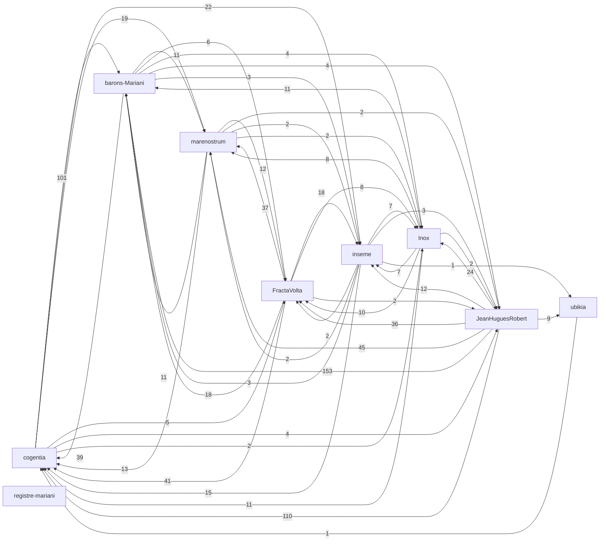

# Corpus Status — barons-Mariani

*Auto-refreshed by `cogentia.js corpus-status`. The structural sections —*
*Registered Repositories, Cross-Reference Graph, Published, What Remains Possible —*
*are regenerated from the registry and from [`research/index.md`](index.md) on every run.*
*The substantive sections — What Is Proved and Open Objections —*
*are manually curated and preserved across refreshes.*

---

## Registered Repositories

<!-- BEGIN_AUTO: registered_repos -->
| Repository | research/index.md | Branch | Policy | Visibility | Public presence |
|---|---|---|---|---|---|
| cogentia | yes | main | all | public | full |
| FractaVolta | yes | main | all | public | full |
| marenostrum | yes | main | all | public | full |
| barons-Mariani | yes | main | all | public | full |
| inseme | yes | main | research | public | full |
| Inox | yes | master | all | public | full |
| registre-mariani | yes | main | all | private | stub |
| ubikia | yes | main | all | public | full |
| JeanHuguesRobert | yes | main | all | public | full |
<!-- END_AUTO: registered_repos -->

---

## Cross-Reference Graph

<!-- BEGIN_AUTO: graph -->

<!-- END_AUTO: graph -->

---

## Concepts

<!-- BEGIN_AUTO: concepts -->
| Concept | Scope | Status | Type |
|---|---|---|---|
| [Civilizational Stakes](./concepts.md#civilizational-stakes) | - | - | - |
| [Machine à explorer](./concepts.md#machine-a-explorer) | Global | Seed | abstract concept / infrastructure protocol |
| [Machine à empêcher](./concepts.md#machine-a-empecher) | Global | Seed | abstract concept |
| [Effet Ubik](./concepts.md#effet-ubik) | Global | Working | sociological / infrastructural pathology |
| [Stabilisateurs (anti-Ubik / procéduraux)](./concepts.md#stabilisateurs-anti-ubik-proceduraux) | Global | Working | mechanism / anti-capture pattern |
| [Cogentia](./concepts.md#cogentia) | - | - | - |
| [Cogentigram](./concepts.md#cogentigram) | Global | Working | representation / map |
| [Potentics](./concepts.md#potentics) | Global | Defined | philosophy |
| [Cognitive Waves](./concepts.md#cognitive-waves) | Global | Working | sociological concept |
| [Mimetic Desynchronization](./concepts.md#mimetic-desynchronization) | Global | Defined | systemic intervention |
| [Invidia](./concepts.md#invidia) | Global | Working | abstract concept |
| [Transition Markets](./concepts.md#transition-markets) | Global | Working | economic model |
| [The Uchronian Museum](./concepts.md#the-uchronian-museum) | Global | Seed | project / concept |
| [Possibilism](./concepts.md#possibilism) | Global | Canonical | ideology |
| [Territoires Possibilistes](./concepts.md#territoires-possibilistes) | project-specific | Working | political framework |
| [Autonomie de capacité](./concepts.md#autonomie-de-capacite) | project-specific | Defined | political framework / operational theory |
| [Kudocracy](./concepts.md#kudocracy) | project-specific | Defined | political framework / civic recommendation layer |
| [Kudos](./concepts.md#kudos) | project-specific | Defined | monetary mechanism / commons-economic instrument |
| [Pathologie du secret](./concepts.md#pathologie-du-secret) | Global | Defined | legal-doctrinal framework |
| [The Second Method](./concepts.md#the-second-method) | repository-specific | Canonical | epistemological framework |
| [Projet Minesteggio](./concepts.md#projet-minesteggio) | project-specific | Working | cultural initiative |
| [Discret Holography](./concepts.md#discret-holography) | repository-specific | Seed | conceptual joke |
<!-- END_AUTO: concepts -->

## Concept Graph

<!-- BEGIN_AUTO: concept_graph -->
```mermaid
graph LR
  c_civilizational_stakes["Civilizational Stakes"]
  c_machine_a_explorer["Machine à explorer"]
  c_machine_a_empecher["Machine à empêcher"]
  c_effet_ubik["Effet Ubik"]
  c_stabilisateurs_anti_ubik_proceduraux["Stabilisateurs (anti-Ubik / procéduraux)"]
  c_cogentia["Cogentia"]
  c_cogentigram["Cogentigram"]
  c_continuation_protocol["Continuation Protocol"]
  c_non_deterministic_cognitive_step_agentic_step["Non-deterministic Cognitive Step (Agentic Step)"]
  c_human_enacted_decision_artifact["Human Enacted Decision Artifact"]
  c_causal_trace_replay_auditable_causal_reconstruction["Causal Trace Replay (Auditable Causal Reconstruction)"]
  c_cognitive_packet["Cognitive Packet"]
  c_cogentia_commons["Cogentia Commons"]
  c_cogentia_pipeline["Cogentia Pipeline"]
  c_derived_product["Derived Product"]
  c_sovereign_digital_twin["Sovereign Digital Twin"]
  c_agent_resumable_cli["Agent-Resumable CLI"]
  c_kernel_extractor["Kernel Extractor"]
  c_kys_know_your_system_psychocognitive_analysis["KYS (Know Your System) / Psychocognitive Analysis"]
  c_cogentia_workflows["Cogentia Workflows"]
  c_cogentia["Cogentia"]
  c_cogentigram["Cogentigram"]
  c_ipn_inference_packet_network["IPN (Inference Packet Network)"]
  c_epn_energy_packet_network["EPN (Energy Packet Network)"]
  c_pgn_power_generation_node["PGN (Power Generation Node)"]
  c_packet_attractors["Packet Attractors"]
  c_the_unconscious_grid["The Unconscious Grid"]
  c_mariani_village["Mariani Village"]
  c_value_shaped_solar["Value-Shaped Solar"]
  c_containerized_compute_tera["Containerized Compute (Tera)"]
  c_traceable_governance["Traceable Governance"]
  c_cogentia["Cogentia"]
  c_cogentigram["Cogentigram"]
  c_dhitl_democratic_human_in_the_loop["DHITL (Democratic Human In The Loop)"]
  c_cxu_compute_and_exergy_unit["CXU (Compute and Exergy Unit)"]
  c_safe_compute_exergy["Safe Compute Exergy"]
  c_constellia["Constellia"]
  c_corsica_forest_synergies["Corsica Forest Synergies"]
  c_infrastructure_is_all_you_need["Infrastructure is All You Need"]
  c_sun_to_sovereignty["Sun to Sovereignty"]
  c_civilizational_stakes["Civilizational Stakes"]
  c_machine_a_explorer["Machine à explorer"]
  c_machine_a_empecher["Machine à empêcher"]
  c_effet_ubik["Effet Ubik"]
  c_stabilisateurs_anti_ubik_proceduraux["Stabilisateurs (anti-Ubik / procéduraux)"]
  c_cogentia["Cogentia"]
  c_cogentigram["Cogentigram"]
  c_potentics["Potentics"]
  c_cognitive_waves["Cognitive Waves"]
  c_mimetic_desynchronization["Mimetic Desynchronization"]
  c_invidia["Invidia"]
  c_transition_markets["Transition Markets"]
  c_the_uchronian_museum["The Uchronian Museum"]
  c_possibilism["Possibilism"]
  c_territoires_possibilistes["Territoires Possibilistes"]
  c_autonomie_de_capacite["Autonomie de capacité"]
  c_kudocracy["Kudocracy"]
  c_kudos["Kudos"]
  c_pathologie_du_secret["Pathologie du secret"]
  c_the_second_method["The Second Method"]
  c_projet_minesteggio["Projet Minesteggio"]
  c_discret_holography["Discret Holography"]
  c_cogentia["Cogentia"]
  c_cogentigram["Cogentigram"]
  c_cop_continuous_operation_protocol["COP (Continuous Operation Protocol)"]
  c_briques["Briques"]
  c_kudocracy["Kudocracy"]
  c_agora["Agora"]
  c_ophelia["Ophélia"]
  c_cop_invariants["COP Invariants"]
  c_non_deterministic_cognitive_step_agentic_step["Non-deterministic Cognitive Step (Agentic Step)"]
  c_human_enacted_decision_artifact["Human Enacted Decision Artifact"]
  c_causal_trace_replay_auditable_causal_reconstruction["Causal Trace Replay (Auditable Causal Reconstruction)"]
  c_cop_cognitive_orchestration_protocol["COP (Cognitive Orchestration Protocol)"]
  c_brique_spec_multi_instance["Brique Spec / Multi-Instance"]
  c_modular_system["Modular System"]
  c_concatenative_language["Concatenative language"]
  c_stack_vm["Stack VM"]
  c_control_data_plane_separation["Control/data plane separation"]
  c_named_values["Named values"]
  c_reactive_sets["Reactive sets"]
  c_actors["Actors"]
  c_dialects["Dialects"]
  c_fractanet["Fractanet"]
  c_cogentia["Cogentia"]
  c_cogentigram["Cogentigram"]
  c_possibilism --> c_machine_a_explorer
  c_democratic_ai_safety --> c_machine_a_explorer
  c_machine_a_explorer --> c_cogentia_commons_declinaison_manuelle
  c_machine_a_explorer --> c_fractanet_cop_declinaison_automatisee
  c_machine_a_explorer --> c_stabilisateurs_anti_ubik
  c_machine_a_explorer -.-> c_continuation_protocol
  c_machine_a_explorer -.-> c_cognitive_packet
  c_machine_a_explorer -.-> c_dhitl_couches_4_5
  c_machine_a_explorer -.-> c_effet_ubik_oppose
  c_machine_a_empecher -.-> c_effet_ubik
  c_machine_a_empecher -.-> c_machine_a_explorer_oppose_symetrique
  c_machine_a_empecher -.-> c_fm_11_outer_optimizer_capture
  c_machine_a_empecher -.-> c_concentration_de_compute_85_frontier
  c_machine_a_empecher --> c_effet_ubik
  c_effet_ubik -.-> c_stabilisateurs_anti_ubik
  c_effet_ubik -.-> c_pathologie_du_secret
  c_effet_ubik -.-> c_invidia_densite_sociale_destructrice
  c_machine_a_explorer --> c_stabilisateurs_anti_ubik_proceduraux
  c_stabilisateurs_anti_ubik_proceduraux -.-> c_effet_ubik
  c_stabilisateurs_anti_ubik_proceduraux -.-> c_continuation_protocol
  c_stabilisateurs_anti_ubik_proceduraux -.-> c_cognitive_packet
  c_stabilisateurs_anti_ubik_proceduraux -.-> c_dhitl_compute_exergy_comme_unite_tracable
  c_cogentia --> c_cogentigram
  c_cogentigram -.-> c_map_vs_territory
  c_cogentigram -.-> c_operational_memory
  c_cogentigram -.-> c_traceable_agency
  c_agent_resumable_cli --> c_continuation_protocol
  c_machine_a_explorer --> c_continuation_protocol
  c_continuation_protocol -.-> c_non_deterministic_cognitive_step
  c_continuation_protocol -.-> c_human_enacted_decision_artifact
  c_continuation_protocol -.-> c_causal_trace_replay
  c_machine_a_explorer --> c_non_deterministic_cognitive_step_agentic_step
  c_non_deterministic_cognitive_step_agentic_step -.-> c_human_enacted_decision_artifact
  c_non_deterministic_cognitive_step_agentic_step -.-> c_causal_trace_replay
  c_non_deterministic_cognitive_step_agentic_step -.-> c_continuation_protocol
  c_machine_a_explorer --> c_human_enacted_decision_artifact
  c_cop_hitl_profile --> c_human_enacted_decision_artifact
  c_human_enacted_decision_artifact -.-> c_non_deterministic_cognitive_step
  c_human_enacted_decision_artifact -.-> c_rule_0_seconde_methode
  c_human_enacted_decision_artifact -.-> c_dhitl_layer_5
  c_cop_invariants --> c_causal_trace_replay_auditable_causal_reconstruction
  c_machine_a_explorer --> c_causal_trace_replay_auditable_causal_reconstruction
  c_causal_trace_replay_auditable_causal_reconstruction -.-> c_continuation_protocol
  c_causal_trace_replay_auditable_causal_reconstruction -.-> c_non_deterministic_cognitive_step
  c_continuation_protocol --> c_cognitive_packet
  c_agent_resumable_cli --> c_cognitive_packet
  c_cognitive_packet --> c_envelope_kind_agnostic_metadata_layer
  c_cognitive_packet --> c_payload_kind_specific_content_layer
  c_cognitive_packet --> c_continuation_payload
  c_cognitive_packet --> c_objection_payload
  c_cognitive_packet --> c_hypothesis_payload
  c_cognitive_packet --> c_decision_payload
  c_cognitive_packet --> c_failure_payload
  c_cognitive_packet --> c_routing_payload
  c_cognitive_packet -.-> c_cogentia_commons
  c_cogentia_commons --> c_cogentia_pipeline
  c_cognitive_packet --> c_cogentia_pipeline
  c_cogentia_pipeline --> c_source_document
  c_cogentia_pipeline --> c_derived_product
  c_cogentia_pipeline --> c_derived_product
  c_derived_product -.-> c_source_document
  c_traceable_agency --> c_cogentia
  c_cogentia --> c_cogentigram
  c_cogentia --> c_operational_memory
  c_cogentia --> c_cogentigram
  c_cogentigram -.-> c_map_vs_territory
  c_cogentigram -.-> c_operational_memory
  c_cogentigram -.-> c_traceable_agency
  c_traceable_agency --> c_cogentia
  c_cogentia --> c_cogentigram
  c_cogentia --> c_operational_memory
  c_cogentia --> c_cogentigram
  c_cogentigram -.-> c_map_vs_territory
  c_cogentigram -.-> c_operational_memory
  c_cogentigram -.-> c_traceable_agency
  c_dhitl --> c_infrastructure_is_all_you_need
  c_possibilism --> c_machine_a_explorer
  c_democratic_ai_safety --> c_machine_a_explorer
  c_machine_a_explorer --> c_cogentia_commons_declinaison_manuelle
  c_machine_a_explorer --> c_fractanet_cop_declinaison_automatisee
  c_machine_a_explorer --> c_stabilisateurs_anti_ubik
  c_machine_a_explorer -.-> c_continuation_protocol
  c_machine_a_explorer -.-> c_cognitive_packet
  c_machine_a_explorer -.-> c_dhitl_couches_4_5
  c_machine_a_explorer -.-> c_effet_ubik_oppose
  c_machine_a_empecher -.-> c_effet_ubik
  c_machine_a_empecher -.-> c_machine_a_explorer_oppose_symetrique
  c_machine_a_empecher -.-> c_fm_11_outer_optimizer_capture
  c_machine_a_empecher -.-> c_concentration_de_compute_85_frontier
  c_machine_a_empecher --> c_effet_ubik
  c_effet_ubik -.-> c_stabilisateurs_anti_ubik
  c_effet_ubik -.-> c_pathologie_du_secret
  c_effet_ubik -.-> c_invidia_densite_sociale_destructrice
  c_machine_a_explorer --> c_stabilisateurs_anti_ubik_proceduraux
  c_stabilisateurs_anti_ubik_proceduraux -.-> c_effet_ubik
  c_stabilisateurs_anti_ubik_proceduraux -.-> c_continuation_protocol
  c_stabilisateurs_anti_ubik_proceduraux -.-> c_cognitive_packet
  c_stabilisateurs_anti_ubik_proceduraux -.-> c_dhitl_compute_exergy_comme_unite_tracable
  c_cogentia --> c_cogentigram
  c_cogentigram -.-> c_map_vs_territory
  c_cogentigram -.-> c_operational_memory
  c_cogentigram -.-> c_traceable_agency
  c_possibilism --> c_autonomie_de_capacite
  c_capabilities_approach_sen_nussbaum --> c_autonomie_de_capacite
  c_autonomie_de_capacite --> c_specificite_de_phase
  c_autonomie_de_capacite --> c_flexibilite_d_usage_redistributive_vs_predatory
  c_autonomie_de_capacite -.-> c_territoires_possibilistes
  c_autonomie_de_capacite -.-> c_auto_institution_democratique_castoriadis
  c_possibilism --> c_kudocracy
  c_auto_institution_democratique_castoriadis --> c_kudocracy
  c_kudocracy -.-> c_autonomie_de_capacite
  c_kudocracy -.-> c_kudos
  c_kudocracy -.-> c_pathologie_du_secret
  c_kudocracy -.-> c_cognitive_packet
  c_possibilism --> c_kudos
  c_communs_ostrom --> c_kudos
  c_kudos -.-> c_kudocracy
  c_kudos -.-> c_autonomie_de_capacite
  c_kudos -.-> c_mauss_gift_counter_gift
  c_democratic_ai_safety_thesis_kernel --> c_pathologie_du_secret
  c_the_second_method --> c_pathologie_du_secret
  c_pathologie_du_secret -.-> c_dhitl_democratic_humans_in_the_loop
  c_pathologie_du_secret -.-> c_cogentia_commons_auditable_knowledge
  c_pathologie_du_secret -.-> c_tracabilite_civique_anti_mafieuse
  c_traceable_agency --> c_cogentia
  c_cogentia --> c_cogentigram
  c_cogentia --> c_operational_memory
  c_cogentia --> c_cogentigram
  c_cogentigram -.-> c_map_vs_territory
  c_cogentigram -.-> c_operational_memory
  c_cogentigram -.-> c_traceable_agency
  c_machine_a_explorer --> c_cop_invariants
  c_stabilisateurs_anti_ubik_proceduraux --> c_cop_invariants
  c_machine_a_explorer --> c_non_deterministic_cognitive_step_agentic_step
  c_non_deterministic_cognitive_step_agentic_step -.-> c_human_enacted_decision_artifact
  c_non_deterministic_cognitive_step_agentic_step -.-> c_causal_trace_replay
  c_machine_a_explorer --> c_human_enacted_decision_artifact
  c_cop_hitl_profile --> c_human_enacted_decision_artifact
  c_human_enacted_decision_artifact -.-> c_non_deterministic_cognitive_step
  c_human_enacted_decision_artifact -.-> c_rule_0_seconde_methode
  c_human_enacted_decision_artifact -.-> c_dhitl_layer_5
  c_cop_invariants --> c_causal_trace_replay_auditable_causal_reconstruction
  c_machine_a_explorer --> c_causal_trace_replay_auditable_causal_reconstruction
  c_causal_trace_replay_auditable_causal_reconstruction -.-> c_deterministic_replay_protocol_layer_only
  c_causal_trace_replay_auditable_causal_reconstruction -.-> c_non_deterministic_cognitive_step
  c_concatenative_language -.-> c_stack_vm
  c_concatenative_language -.-> c_named_values
  c_stack_vm -.-> c_concatenative_language
  c_stack_vm -.-> c_control_data_plane_separation
  c_stack_vm -.-> c_named_values
  c_stack_vm --> c_control_data_plane_separation
  c_control_data_plane_separation -.-> c_energy_packet_network_fractavolta
  c_control_data_plane_separation -.-> c_cognitive_packet_envelope_payload_cogentia
  c_stack_vm --> c_named_values
  c_fractanet -.-> c_energy_packet_network_fractavolta
  c_fractanet -.-> c_auxilia_inseme_brique_human_scale_fractanet_exchange
  c_fractanet -.-> c_actors
  c_traceable_agency --> c_cogentia
  c_cogentia --> c_cogentigram
  c_cogentia --> c_operational_memory
  c_cogentia --> c_cogentigram
  c_cogentigram -.-> c_map_vs_territory
  c_cogentigram -.-> c_operational_memory
  c_cogentigram -.-> c_traceable_agency
  click c_civilizational_stakes "https://github.com/JeanHuguesRobert/cogentia/blob/main/research/concepts.md#civilizational-stakes" "Open Civilizational Stakes"
  click c_machine_a_explorer "https://github.com/JeanHuguesRobert/cogentia/blob/main/research/concepts.md#machine-a-explorer" "Open Machine à explorer"
  click c_machine_a_empecher "https://github.com/JeanHuguesRobert/cogentia/blob/main/research/concepts.md#machine-a-empecher" "Open Machine à empêcher"
  click c_effet_ubik "https://github.com/JeanHuguesRobert/cogentia/blob/main/research/concepts.md#effet-ubik" "Open Effet Ubik"
  click c_stabilisateurs_anti_ubik_proceduraux "https://github.com/JeanHuguesRobert/cogentia/blob/main/research/concepts.md#stabilisateurs-anti-ubik-proceduraux" "Open Stabilisateurs (anti-Ubik / procéduraux)"
  click c_cogentia "https://github.com/JeanHuguesRobert/cogentia/blob/main/research/concepts.md#cogentia" "Open Cogentia"
  click c_cogentigram "https://github.com/JeanHuguesRobert/cogentia/blob/main/research/concepts.md#cogentigram" "Open Cogentigram"
  click c_continuation_protocol "https://github.com/JeanHuguesRobert/cogentia/blob/main/research/concepts.md#continuation-protocol" "Open Continuation Protocol"
  click c_non_deterministic_cognitive_step_agentic_step "https://github.com/JeanHuguesRobert/cogentia/blob/main/research/concepts.md#non-deterministic-cognitive-step-agentic-step" "Open Non-deterministic Cognitive Step (Agentic Step)"
  click c_human_enacted_decision_artifact "https://github.com/JeanHuguesRobert/cogentia/blob/main/research/concepts.md#human-enacted-decision-artifact" "Open Human Enacted Decision Artifact"
  click c_causal_trace_replay_auditable_causal_reconstruction "https://github.com/JeanHuguesRobert/cogentia/blob/main/research/concepts.md#causal-trace-replay-auditable-causal-reconstruction" "Open Causal Trace Replay (Auditable Causal Reconstruction)"
  click c_cognitive_packet "https://github.com/JeanHuguesRobert/cogentia/blob/main/research/concepts.md#cognitive-packet" "Open Cognitive Packet"
  click c_cogentia_commons "https://github.com/JeanHuguesRobert/cogentia/blob/main/research/concepts.md#cogentia-commons" "Open Cogentia Commons"
  click c_cogentia_pipeline "https://github.com/JeanHuguesRobert/cogentia/blob/main/research/concepts.md#cogentia-pipeline" "Open Cogentia Pipeline"
  click c_derived_product "https://github.com/JeanHuguesRobert/cogentia/blob/main/research/concepts.md#derived-product" "Open Derived Product"
  click c_sovereign_digital_twin "https://github.com/JeanHuguesRobert/cogentia/blob/main/research/concepts.md#sovereign-digital-twin" "Open Sovereign Digital Twin"
  click c_agent_resumable_cli "https://github.com/JeanHuguesRobert/cogentia/blob/main/research/concepts.md#agent-resumable-cli" "Open Agent-Resumable CLI"
  click c_kernel_extractor "https://github.com/JeanHuguesRobert/cogentia/blob/main/research/concepts.md#kernel-extractor" "Open Kernel Extractor"
  click c_kys_know_your_system_psychocognitive_analysis "https://github.com/JeanHuguesRobert/cogentia/blob/main/research/concepts.md#kys-know-your-system-psychocognitive-analysis" "Open KYS (Know Your System) / Psychocognitive Analysis"
  click c_cogentia_workflows "https://github.com/JeanHuguesRobert/cogentia/blob/main/research/concepts.md#cogentia-workflows" "Open Cogentia Workflows"
  click c_cogentia "https://github.com/JeanHuguesRobert/FractaVolta/blob/main/research/concepts.md#cogentia" "Open Cogentia"
  click c_cogentigram "https://github.com/JeanHuguesRobert/FractaVolta/blob/main/research/concepts.md#cogentigram" "Open Cogentigram"
  click c_ipn_inference_packet_network "https://github.com/JeanHuguesRobert/FractaVolta/blob/main/research/concepts.md#ipn-inference-packet-network" "Open IPN (Inference Packet Network)"
  click c_epn_energy_packet_network "https://github.com/JeanHuguesRobert/FractaVolta/blob/main/research/concepts.md#epn-energy-packet-network" "Open EPN (Energy Packet Network)"
  click c_pgn_power_generation_node "https://github.com/JeanHuguesRobert/FractaVolta/blob/main/research/concepts.md#pgn-power-generation-node" "Open PGN (Power Generation Node)"
  click c_packet_attractors "https://github.com/JeanHuguesRobert/FractaVolta/blob/main/research/concepts.md#packet-attractors" "Open Packet Attractors"
  click c_the_unconscious_grid "https://github.com/JeanHuguesRobert/FractaVolta/blob/main/research/concepts.md#the-unconscious-grid" "Open The Unconscious Grid"
  click c_mariani_village "https://github.com/JeanHuguesRobert/FractaVolta/blob/main/research/concepts.md#mariani-village" "Open Mariani Village"
  click c_value_shaped_solar "https://github.com/JeanHuguesRobert/FractaVolta/blob/main/research/concepts.md#value-shaped-solar" "Open Value-Shaped Solar"
  click c_containerized_compute_tera "https://github.com/JeanHuguesRobert/FractaVolta/blob/main/research/concepts.md#containerized-compute-tera" "Open Containerized Compute (Tera)"
  click c_traceable_governance "https://github.com/JeanHuguesRobert/FractaVolta/blob/main/research/concepts.md#traceable-governance" "Open Traceable Governance"
  click c_cogentia "https://github.com/JeanHuguesRobert/marenostrum/blob/main/research/concepts.md#cogentia" "Open Cogentia"
  click c_cogentigram "https://github.com/JeanHuguesRobert/marenostrum/blob/main/research/concepts.md#cogentigram" "Open Cogentigram"
  click c_dhitl_democratic_human_in_the_loop "https://github.com/JeanHuguesRobert/marenostrum/blob/main/research/concepts.md#dhitl-democratic-human-in-the-loop" "Open DHITL (Democratic Human In The Loop)"
  click c_cxu_compute_and_exergy_unit "https://github.com/JeanHuguesRobert/marenostrum/blob/main/research/concepts.md#cxu-compute-and-exergy-unit" "Open CXU (Compute and Exergy Unit)"
  click c_safe_compute_exergy "https://github.com/JeanHuguesRobert/marenostrum/blob/main/research/concepts.md#safe-compute-exergy" "Open Safe Compute Exergy"
  click c_constellia "https://github.com/JeanHuguesRobert/marenostrum/blob/main/research/concepts.md#constellia" "Open Constellia"
  click c_corsica_forest_synergies "https://github.com/JeanHuguesRobert/marenostrum/blob/main/research/concepts.md#corsica-forest-synergies" "Open Corsica Forest Synergies"
  click c_infrastructure_is_all_you_need "https://github.com/JeanHuguesRobert/marenostrum/blob/main/research/concepts.md#infrastructure-is-all-you-need" "Open Infrastructure is All You Need"
  click c_sun_to_sovereignty "https://github.com/JeanHuguesRobert/marenostrum/blob/main/research/concepts.md#sun-to-sovereignty" "Open Sun to Sovereignty"
  click c_civilizational_stakes "https://github.com/JeanHuguesRobert/barons-Mariani/blob/main/research/concepts.md#civilizational-stakes" "Open Civilizational Stakes"
  click c_machine_a_explorer "https://github.com/JeanHuguesRobert/barons-Mariani/blob/main/research/concepts.md#machine-a-explorer" "Open Machine à explorer"
  click c_machine_a_empecher "https://github.com/JeanHuguesRobert/barons-Mariani/blob/main/research/concepts.md#machine-a-empecher" "Open Machine à empêcher"
  click c_effet_ubik "https://github.com/JeanHuguesRobert/barons-Mariani/blob/main/research/concepts.md#effet-ubik" "Open Effet Ubik"
  click c_stabilisateurs_anti_ubik_proceduraux "https://github.com/JeanHuguesRobert/barons-Mariani/blob/main/research/concepts.md#stabilisateurs-anti-ubik-proceduraux" "Open Stabilisateurs (anti-Ubik / procéduraux)"
  click c_cogentia "https://github.com/JeanHuguesRobert/barons-Mariani/blob/main/research/concepts.md#cogentia" "Open Cogentia"
  click c_cogentigram "https://github.com/JeanHuguesRobert/barons-Mariani/blob/main/research/concepts.md#cogentigram" "Open Cogentigram"
  click c_potentics "https://github.com/JeanHuguesRobert/barons-Mariani/blob/main/research/concepts.md#potentics" "Open Potentics"
  click c_cognitive_waves "https://github.com/JeanHuguesRobert/barons-Mariani/blob/main/research/concepts.md#cognitive-waves" "Open Cognitive Waves"
  click c_mimetic_desynchronization "https://github.com/JeanHuguesRobert/barons-Mariani/blob/main/research/concepts.md#mimetic-desynchronization" "Open Mimetic Desynchronization"
  click c_invidia "https://github.com/JeanHuguesRobert/barons-Mariani/blob/main/research/concepts.md#invidia" "Open Invidia"
  click c_transition_markets "https://github.com/JeanHuguesRobert/barons-Mariani/blob/main/research/concepts.md#transition-markets" "Open Transition Markets"
  click c_the_uchronian_museum "https://github.com/JeanHuguesRobert/barons-Mariani/blob/main/research/concepts.md#the-uchronian-museum" "Open The Uchronian Museum"
  click c_possibilism "https://github.com/JeanHuguesRobert/barons-Mariani/blob/main/research/concepts.md#possibilism" "Open Possibilism"
  click c_territoires_possibilistes "https://github.com/JeanHuguesRobert/barons-Mariani/blob/main/research/concepts.md#territoires-possibilistes" "Open Territoires Possibilistes"
  click c_autonomie_de_capacite "https://github.com/JeanHuguesRobert/barons-Mariani/blob/main/research/concepts.md#autonomie-de-capacite" "Open Autonomie de capacité"
  click c_kudocracy "https://github.com/JeanHuguesRobert/barons-Mariani/blob/main/research/concepts.md#kudocracy" "Open Kudocracy"
  click c_kudos "https://github.com/JeanHuguesRobert/barons-Mariani/blob/main/research/concepts.md#kudos" "Open Kudos"
  click c_pathologie_du_secret "https://github.com/JeanHuguesRobert/barons-Mariani/blob/main/research/concepts.md#pathologie-du-secret" "Open Pathologie du secret"
  click c_the_second_method "https://github.com/JeanHuguesRobert/barons-Mariani/blob/main/research/concepts.md#the-second-method" "Open The Second Method"
  click c_projet_minesteggio "https://github.com/JeanHuguesRobert/barons-Mariani/blob/main/research/concepts.md#projet-minesteggio" "Open Projet Minesteggio"
  click c_discret_holography "https://github.com/JeanHuguesRobert/barons-Mariani/blob/main/research/concepts.md#discret-holography" "Open Discret Holography"
  click c_cogentia "https://github.com/JeanHuguesRobert/inseme/blob/main/research/concepts.md#cogentia" "Open Cogentia"
  click c_cogentigram "https://github.com/JeanHuguesRobert/inseme/blob/main/research/concepts.md#cogentigram" "Open Cogentigram"
  click c_cop_continuous_operation_protocol "https://github.com/JeanHuguesRobert/inseme/blob/main/research/concepts.md#cop-continuous-operation-protocol" "Open COP (Continuous Operation Protocol)"
  click c_briques "https://github.com/JeanHuguesRobert/inseme/blob/main/research/concepts.md#briques" "Open Briques"
  click c_kudocracy "https://github.com/JeanHuguesRobert/inseme/blob/main/research/concepts.md#kudocracy" "Open Kudocracy"
  click c_agora "https://github.com/JeanHuguesRobert/inseme/blob/main/research/concepts.md#agora" "Open Agora"
  click c_ophelia "https://github.com/JeanHuguesRobert/inseme/blob/main/research/concepts.md#ophelia" "Open Ophélia"
  click c_cop_invariants "https://github.com/JeanHuguesRobert/inseme/blob/main/research/concepts.md#cop-invariants" "Open COP Invariants"
  click c_non_deterministic_cognitive_step_agentic_step "https://github.com/JeanHuguesRobert/inseme/blob/main/research/concepts.md#non-deterministic-cognitive-step-agentic-step" "Open Non-deterministic Cognitive Step (Agentic Step)"
  click c_human_enacted_decision_artifact "https://github.com/JeanHuguesRobert/inseme/blob/main/research/concepts.md#human-enacted-decision-artifact" "Open Human Enacted Decision Artifact"
  click c_causal_trace_replay_auditable_causal_reconstruction "https://github.com/JeanHuguesRobert/inseme/blob/main/research/concepts.md#causal-trace-replay-auditable-causal-reconstruction" "Open Causal Trace Replay (Auditable Causal Reconstruction)"
  click c_cop_cognitive_orchestration_protocol "https://github.com/JeanHuguesRobert/inseme/blob/main/research/concepts.md#cop-cognitive-orchestration-protocol" "Open COP (Cognitive Orchestration Protocol)"
  click c_brique_spec_multi_instance "https://github.com/JeanHuguesRobert/inseme/blob/main/research/concepts.md#brique-spec-multi-instance" "Open Brique Spec / Multi-Instance"
  click c_modular_system "https://github.com/JeanHuguesRobert/inseme/blob/main/research/concepts.md#modular-system" "Open Modular System"
  click c_concatenative_language "https://github.com/JeanHuguesRobert/Inox/blob/master/research/concepts.md#concatenative-language" "Open Concatenative language"
  click c_stack_vm "https://github.com/JeanHuguesRobert/Inox/blob/master/research/concepts.md#stack-vm" "Open Stack VM"
  click c_control_data_plane_separation "https://github.com/JeanHuguesRobert/Inox/blob/master/research/concepts.md#control-data-plane-separation" "Open Control/data plane separation"
  click c_named_values "https://github.com/JeanHuguesRobert/Inox/blob/master/research/concepts.md#named-values" "Open Named values"
  click c_reactive_sets "https://github.com/JeanHuguesRobert/Inox/blob/master/research/concepts.md#reactive-sets" "Open Reactive sets"
  click c_actors "https://github.com/JeanHuguesRobert/Inox/blob/master/research/concepts.md#actors" "Open Actors"
  click c_dialects "https://github.com/JeanHuguesRobert/Inox/blob/master/research/concepts.md#dialects" "Open Dialects"
  click c_fractanet "https://github.com/JeanHuguesRobert/Inox/blob/master/research/concepts.md#fractanet" "Open Fractanet"
  click c_cogentia "https://github.com/JeanHuguesRobert/JeanHuguesRobert/blob/main/research/concepts.md#cogentia" "Open Cogentia"
  click c_cogentigram "https://github.com/JeanHuguesRobert/JeanHuguesRobert/blob/main/research/concepts.md#cogentigram" "Open Cogentigram"
```

*Orphan concepts: `Civilizational Stakes` (cogentia), `Cogentia` (cogentia), `Cogentia Commons` (cogentia), `Sovereign Digital Twin` (cogentia), `Agent-Resumable CLI` (cogentia), `Kernel Extractor` (cogentia), `KYS (Know Your System) / Psychocognitive Analysis` (cogentia), `Cogentia Workflows` (cogentia), `IPN (Inference Packet Network)` (FractaVolta), `EPN (Energy Packet Network)` (FractaVolta), `PGN (Power Generation Node)` (FractaVolta), `Packet Attractors` (FractaVolta), `The Unconscious Grid` (FractaVolta), `Mariani Village` (FractaVolta), `Value-Shaped Solar` (FractaVolta), `Containerized Compute (Tera)` (FractaVolta), `Traceable Governance` (FractaVolta), `DHITL (Democratic Human In The Loop)` (marenostrum), `CXU (Compute and Exergy Unit)` (marenostrum), `Safe Compute Exergy` (marenostrum), `Constellia` (marenostrum), `Corsica Forest Synergies` (marenostrum), `Sun to Sovereignty` (marenostrum), `Civilizational Stakes` (barons-Mariani), `Cogentia` (barons-Mariani), `Potentics` (barons-Mariani), `Cognitive Waves` (barons-Mariani), `Mimetic Desynchronization` (barons-Mariani), `Invidia` (barons-Mariani), `Transition Markets` (barons-Mariani), `The Uchronian Museum` (barons-Mariani), `Possibilism` (barons-Mariani), `Territoires Possibilistes` (barons-Mariani), `The Second Method` (barons-Mariani), `Projet Minesteggio` (barons-Mariani), `Discret Holography` (barons-Mariani), `COP (Continuous Operation Protocol)` (inseme), `Briques` (inseme), `Kudocracy` (inseme), `Agora` (inseme), `Ophélia` (inseme), `COP (Cognitive Orchestration Protocol)` (inseme), `Brique Spec / Multi-Instance` (inseme), `Modular System` (inseme), `Reactive sets` (Inox), `Actors` (Inox), `Dialects` (Inox).*

*Referenced but undefined: `Democratic AI Safety`, `Cogentia Commons (déclinaison manuelle)`, `Fractanet / COP (déclinaison automatisée)`, `Stabilisateurs (anti-Ubik)`, `DHITL (couches 4/5)`, `Effet Ubik (opposé)`, `Machine à explorer (opposé symétrique)`, `FM-11 (outer optimizer capture)`, `Concentration de compute (85% frontier)`, `Invidia (densité sociale destructrice)`, `DHITL (Compute Exergy comme unité traçable)`, `Map vs territory`, `Operational memory`, `Traceable agency`, `Non-deterministic Cognitive Step`, `Causal Trace Replay`, `COP/HITL Profile`, `Rule 0 (seconde méthode)`, `DHITL Layer 5`, `Envelope (kind-agnostic metadata layer)`, `Payload (kind-specific content layer)`, `Continuation payload`, `Objection payload`, `Hypothesis payload`, `Decision payload`, `Failure payload`, `Routing payload`, `Source Document`, `DHITL`, `Capabilities approach (Sen, Nussbaum)`, `Spécificité de phase`, `Flexibilité d'usage (redistributive vs. predatory)`, `Auto-institution démocratique (Castoriadis)`, `Communs (Ostrom)`, `Mauss — gift / counter-gift`, `Democratic AI Safety (thesis kernel)`, `DHITL — Democratic Humans in the Loop`, `Cogentia Commons (auditable knowledge)`, `Traçabilité civique anti-mafieuse`, `Deterministic Replay (protocol layer only)`, `Energy Packet Network (FractaVolta)`, `Cognitive Packet envelope/payload (Cogentia)`, `Auxilia (Inseme brique — human-scale Fractanet exchange)`.*
<!-- END_AUTO: concept_graph -->

---

## Published in this repo

<!-- BEGIN_AUTO: published -->
| Title | Location | Date |
|---|---|---|
| [Discours de la seconde méthode](second_method.md) *(founding methodological doctrine — v1.0)* | this repo | 2026-05-08 |
| [Lien avec C.O.R.S.I.C.A. et l’Institut Mariani](acorsica-institut-mariani.md) *(institutional boundary note — future Barons Mariani fund, museum, C.O.R.S.I.C.A. and Institut Mariani)* | this repo | 2026-06-03 |
| [Autonomia — Capabilités collectives, capital territorial et flexibilité d'usage dans le cas corse (FR)](autonomia.md) *(working paper v0.12 — succède à `autonomie.md`)* | this repo | 2026-05-18 |
| [Corsica2038 — De la prospective subie à l'autonomie de capacité (FR)](autonomia/corsica2038_contre_rapport_pruspettiva2050.md) *(working paper v0.1-draft — base programmatique et contre-rapport constructif face à Corsica Pruspettiva 2050)* | this repo | 2026-06-09 |
| [Projet #1755 — Réintégrer la séquence corse 1729–1755 dans l'histoire mondiale du constitutionnalisme démocratique moderne (FR)](autonomia/projet_1755.md) *(document source ouvert v0.13 — premier test d'« autonomie de capacité » ; dashboard public dans [`autonomia/1755.md`](autonomia/1755.md))* | this repo | 2026-05-26 |
| [Autonomia — Journal du test 1755 (reconnaissance internationale de la République corse)](autonomia/1755.md) *(journal de bord public — produit dérivé de [`autonomia/projet_1755.md`](autonomia/projet_1755.md))* | this repo | 2026-05 → |
| [Grammaire générative de l'Autonomie de Capacité (FR)](autonomia/grammaire_autonomie_de_capacite.md) *(méthode source v1.0 — produire réponses, programmes, discours et produits déclinés orientés « Une Corse capable »)* | this repo | 2026-05-27 |
| [Atlas du paysage politique et discursif corse — Une Corse capable (FR)](autonomia/atlas_paysage_politique_corse.md) *(atlas v1.0-atlas — acteurs, terrains rhétoriques, axes de polarisation, formules de reconfiguration)* | this repo | 2026-05-27 |
| [Actualisation de l'atlas du paysage politique corse — séquence parlementaire de juin 2026 (FR)](autonomia/atlas_paysage_politique_corse_actualisation_2026-06.md) *(working paper v0.1 — actualisation à intégrer dans l'atlas principal)* | this repo | 2026-06-06 |
| [Stock de formules publiques — Autonomie de Capacité (FR)](autonomia/formules_publiques_autonomie_capacite.md) *(annexe v0.57 — bibliothèque de formules publiques, terrains rhétoriques, contre-formules pour Une Corse capable)* | this repo | 2026-05-27 |
| [Le Petit Parti — Mode d'emploi de l'Autonomie de Capacité (FR)](autonomia/mode_emploi_petit_parti_autonomie_de_capacite.md) *(working draft v0.1 — guide court pour militants, sympathisants, candidats et relais locaux)* | this repo | 2026-05-27 |
| [Traçabilité des actes : mandat, imputabilité et contrôle des actes engageants (FR)](traceabilite_des_actes.md) *(working paper v0.15.1-research — ChatGPT drafting + Grok review + JHR arbitration ; dérivé blogpost dans [`traceabilite_des_actes_blogpost.md`](traceabilite_des_actes_blogpost.md))* | this repo | 2026-05-27 |
| [GR20 : du quota à l'autonomie de capacité (FR)](gr20_autonomie_de_capacite.md) *(note de campagne — application montagne)* | this repo | 2026-05-16 |
| [Traçabilité civique anti-mafieuse — documenter l'emprise sans créer une société de surveillance (FR)](traceabilite_civique_antimafia.md) *(note de campagne)* | this repo | 2026-05-16 |
| [Democratic AI Safety — Why AI Safety Must Protect Human Sovereignty Against AI-Augmented Legal Persons](democratic_ai_safety.md) *(working paper, draft v0.5 — merged from prior parallel cogentia draft)* | this repo | 2026-05-18 |
| [La pathologie du secret — Imputabilité humaine, traçabilité démocratique et refus de l'irresponsabilité artificielle (FR)](pathologie_du_secret.md) *(working paper v0.4 — droit positif français/européen, cas DataJust ; pendant juridique de Democratic AI Safety)* | this repo | 2026-05-20 |
| [Dongles propriétaires perdus : pour un droit à la remise en service des périphériques fonctionnels](dongles_proprietaires_et_droit_a_la_remise_en_service.md) *(working paper v0.1 — doctrine juridique et technique de la réparabilité effective)* | this repo | 2026-06-10 |
| [Fabriquer la loi comme un corpus vivant (FR)](legistique_cognitive.md) *(working paper v0.2 — légistique cognitive et corpus vivant, source candidate after checkpoint)* | this repo | 2026-06-02 |
| [DAO, imputabilité et DHITL (FR)](dao_imputabilite_dhitl.md) *(working paper v0.2 — academic source form, media/legal reinforced)* | this repo | 2026-06-03 |
| [Process note — DAO, imputabilité et DHITL](dao_imputabilite_dhitl_process.md) *(companion process note v0.1)* | this repo | 2026-06-03 |
| [Kudocracy — Recommandation civique traçable, votations et démocratie liquide assistée par agents (FR)](kudocracy.md) *(working paper v0.1)* | this repo | 2026-05-20 |
| [Kudos — Une monnaie complémentaire maussienne, adossée à l'euro (FR)](kudos.md) *(working paper draft v0.3)* | this repo | 2026-05-20 |
| [La méthode des terrains féconds — Dépolariser par reconfiguration préalable des oppositions (FR)](methode_terrains_feconds.md) *(working paper v0.4 — protocole pré-délibératif)* | this repo | 2026-05-21 |
| [Démocratie capable (FR)](democratie_capable.md) *(working paper v0.4 — open democracy, democratic scaling, and Autonomie de Capacité)* | this repo | 2026-06-06 |
| [Le passé est aussi imprévisible que le futur (FR)](trace_epistemology.md) *(working paper v0.3 — trace epistemology, consolidated source document)* | this repo | 2026-06-05 |
| [Mandats express et démocratie capable de crise](democratie_crise_mandats_express.md) *(document source v0.3 — répondre à l'objection de lenteur démocratique sans ouvrir la voie à l'état d'exception tyrannique)* | this repo | 2026-06-12 |
| [Incremental Transmissible Corpus Model](modele_corpus_transmissible_incremental.md) *(working paper v0.3 — cognitive backtracking, qualitative stigmergy, and cumulative exploration of possibilities)* | this repo | 2026-06-13 |
| [Constructive Review: Incremental Transmissible Corpus Model](modele_corpus_transmissible_incremental_grok_review_2026-06-13.md) *(archived external review v0.1 — Grok review signal preserved for the incremental corpus model)* | this repo | 2026-06-13 |
| [Reality Safety](reality_safety_procedural_stabilizers.md) *(source draft v0.9 — AI Safety as revealer of a deeper crisis of shared reality and procedural stabilizers)* | this repo | 2026-06-15 |
| [Serenia — Assistance à l'autonomie administrative, numérique et cognitive](serenia_autonomie_assistee_ia.md) *(source note v0.1 — administrative, digital and cognitive autonomy support with AI)* | this repo | 2026-06-13 |
| [Invidia — envie et désir mimétique](../invidia.md) | this repo | 2026 |
| [Indirect Action Under Mimetic Constraints](../mimetic_desynchronization.md) | this repo | 2026 |
| [Toy Story, AI, and Mimetic Desynchronization — Cultural Strategy for Cognitive Transition](../toy_story.md) *(v6.0)* | this repo | 2026-05-11 |
| [VIGILIA — Distributed avoidance, signalling, and territorial perception (FR)](../vigilia.md) *(v1.3)* | this repo | 2026-05-12 |
| [The Generalized Tocqueville Law — Progress, Rising Expectations, Structural Dissatisfaction](../tocqueville_law.md) | this repo | 2026 |
| [The Republic of Donkeys — A Situated Micro-Experiment in Commons Governance](../the_republic_of_donkeys.md) *(v2.0)* | this repo | 2026 |
| [Markets of Usage Transitions in Multi-Use Physical Assets](../transition_markets.md) | this repo | 2026 |
| [Terrain Configuration Theory for Democratic AI Infrastructure](../terrain_configuration.md) | this repo | 2026 |
| [Possibilism — Notes Toward a Research Program](../possibilism_04_2026.md) | this repo | 2026-04 |
| [Territoires possibilistes — Autonomie alimentaire, diversité épistémique et innovation durable (FR)](territoires_possibilistes.md) | this repo | 2026 |
| [Le Musée uchronique comme dispositif d'inférence historique (FR)](../uchronian_museum.md) | this repo | 2026 |
| [Projet Minesteggio — Fondation Barons Mariani / Musée Uchronique « Napoléon 1821 » (FR)](../projet_minesteggio.md) | this repo | 2026 |
| [Literary Works as Navigable Spaces — AI-Based Cultural Mediation](../ai-based-cultural-mediation.md) | this repo | 2026 |
| [Architecture de l'univers-automate — résolution systémique 2D-4D (FR)](../discret_holography.md) | this repo | 2026-02-27 |
| [Sailing the Cognitive Waves — Stigmergic Cognitive-Terrain Framework](cognitive_waves.md) | this repo | 2026 |
| [Stigmergie sans limite haute — continuité stigmergique des mouches aux agents cognitifs (FR)](stigmergie_sans_limite_haute.md) *(amorce de jonction v0.2, 2026-05-31 — pont scale-free + alignement Rossignol §4)* | this repo | 2026-05-31 |
| [Test du critère Rossignol — quatre dispositifs au crible (FR)](test_critere_rossignol.md) *(working-note v0.1, 2026-05-31 — applique le critère « pas de stabilisateur sans Rossignol » à Cogentia / traçabilité symétrique / FractaVolta / Kudocracy)* | this repo | 2026-05-31 |
| [Des bleus de travail aux bleus de mémoire — Bleu de Chine, denim et patrimonialisation méditerranéenne (FR)](patrimoine/bleu_chine_denim_article_academique.md) *(academic draft v0.1 — dossier patrimoine/ ; companions : [chronologie](patrimoine/bleu_chine_denim_chronologie.md), [sources annotées](patrimoine/bleu_chine_denim_sources_annotees.md))* | this repo | 2026-05-30 |
| [Potentics — Toward a Science of the Possible](potentics.md) | this repo | 2026 |
| [Marx, les écrans de télévision et la fragilité des adversaires du capitalisme (FR)](marx_capitalisme_antifragile.md) *(working paper v0.6.1 — critique possibiliste du capitalisme comme système antifragile)* | this repo | 2026-06-03 |
| [Protection responsable](../protection_responsable.md) | this repo | 2026 |
| [Impunité par obscurité — Le cas corse comme révélateur d'un déficit d'imputabilité institutionnelle (FR)](autonomia/impunite_par_obscurite_cas_corse.md) *(published working paper v0.5 — academic symmetric source ; couple blogpost dérivé)* | this repo | 2026-06-01 |
| [L'autonomie ne doit pas devenir un transfert d'opacité — À propos de l'impunité par obscurité (FR)](autonomia/impunite_par_obscurite_blogpost.md) *(derived product v0.1 — Substack draft)* | this repo | 2026-06-01 |
| [PLU de Corte — Rapport OSINT provisoire sur Riacquistu Data-Driven (FR)](autonomia/plu_de_corte.md) *(enquête OSINT politique v0.5 — document source long pour publication ; statut explicitement exploratoire, non stabilisée doctrinalement)* | this repo | 2026-06-01 |
| [Le théâtre des pays imaginaires de Corse — Fables sérieuses sur le processus de Beauvau (FR)](autonomia/theatre_pays_imaginaires_corse_beauvau.md) *(produit décliné satirique et documentaire v0.1)* | this repo | 2026-05-28 |
| [Le théâtre des pays imaginaires de Corse — version blogpost (FR)](autonomia/theatre_pays_imaginaires_corse_beauvau_blogpost.md) *(blogpost v0.1, dérivé du satirique)* | this repo | 2026-05-28 |
| [Contribution écrite à la commission des Lois — Autonomie de capacité de la Corse (FR)](contribution_commission_lois_autonomie_capacite.md) *(version de travail v0.1, à relire avant envoi — dossier décliné en formats 1/2/4/8/16 pages)* | this repo | 2026-05-28 |
| [Note synthétique pour examen parlementaire — Autonomie de capacité de la Corse (FR)](note_synthetique_autonomie_capacite_corse.md) *(operational note v0.1 — proposition de finalité constitutionnelle)* | this repo | 2026-05-24 |
| [Courrier public aux six parlementaires de Corse — Pour une autonomie de capacité réelle (FR)](courrier_public_six_parlementaires_corse.md) *(public letter v0.6)* | this repo | 2026-05-24 |
| [Proposition constitutionnelle — autonomie de capacité de la Corse (FR)](proposition_constitutionnelle_autonomie_capacite_corse.md) *(constitutional proposal v0.1 — contribution à la rédaction du futur article 72-5)* | this repo | 2026-05-24 |
| [Simplifier ou rendre capable ? (FR)](exces_de_vitesse_administrative_blocpost.md) *(blog draft — capability-oriented critique of administrative acceleration)* | this repo | 2026-06-03 |
| [Déclaration d'indépendance de capacité de la Corse — Après 1755, à l'âge du cyberespace (FR)](declaration_independance_capacite_corse.md) *(derived product v0.1 — produit décliné de la proposition constitutionnelle)* | this repo | 2026-05-24 |
| [Chronologie documentaire du processus de Beauvau — de l'agression d'Yvan Colonna au projet constitutionnel d'autonomie (FR)](chronologie_processus_beauvau_corse.md) *(documentary timeline v0.18)* | this repo | 2026-05-24 |
| [Stabilité extractive — La Corse comme refuge de réalité dans un monde disloqué (FR)](corsica_stability_extraction.md) *(source document v0.1)* | this repo | 2026-05-24 |
| [Bleu de Chine, denim et indigo — Note préliminaire (FR)](patrimoine/bleu_chine_denim_nimes_corse_v0.1.md) *(preliminary research note v0.1 — premier état du dossier patrimoine ; précurseur de l'article académique)* | this repo | 2026-05-30 |
| [Bleu de Chine, denim et indigo — Protocole de recherche v0.2 (FR)](patrimoine/bleu_chine_denim_nimes_corse_v0.2.md) *(research protocol working-paper v0.2 — evidence matrix pour l'article académique)* | this repo | 2026-05-30 |
| [Verticalisation de la Chrétienté — Du Dieu-à-côté au Dieu-au-dessus (FR)](christianity_verticalization.md) *(working paper v0.4 — esquisse historique, politique et symbolique)* | this repo | 2026-05-25 |
| [Dieu au-dessus, Dieu à côté : pourquoi l'âne compte politiquement (FR)](christianity_verticalization_blogpost.md) *(blog derived form v0.1 — dérivé de la Verticalisation de la Chrétienté)* | this repo | 2026-05-25 |
| [Mauvaise calibration métacognitive face aux intelligences xénoformes (FR)](alien_academic.md) *(working paper v0.7 — academic form ; pour une AI Safety post-anthropocentrique)* | this repo | 2026-05-25 |
| [Alien, l'IA et les intelligences xénoformes — version blog (FR)](alien_blogpost.md) *(blog derived form v0.2 — dérivé du papier académique alien)* | this repo | 2026-05-25 |
| [Archaïsme et Modernité dans la création insulaire — Continuation 2026 (FR)](archaisme_modernite_continuation_2026_blogpost.md) *(blogpost continuation v0.1)* | this repo | 2026-05-26 |
| [La seconde méthode comme généralisation prudente de l'agile (FR)](agile.md) *(working paper v0.5 — régimes d'erreur, expérimentation traçable, apprentissage collectif sous complexité)* | this repo | 2026-05-23 |
| [Institut Mariani — définition, rôle et généalogie documentaire (FR)](institut_mariani.md) *(working note — institutional definition and lineage)* | this repo | 2026-05-29 |
| [Corpus Status](corpus-status.md) *(living view — auto-refreshed by `cogentia.js corpus-status`)* | this repo | refreshable |
| [Concept Index](concepts.md) *(typed concept registry — mapped by `cogentia.js concepts`)* | this repo | refreshable |
<!-- END_AUTO: published -->

---

## What Is Proved

*Manually curated: claims demonstrated by the published work in this corpus.*

| Claim | Status | Evidence |
|---|---|---|
| Public corpus improves via objection integration | ✅ Demonstrated | v0.1→v1.0 git history of [`second_method.md`](second_method.md), multiple public AI reviews integrated |
| Machine-readable structure does not degrade human readability | 🔄 In progress | [`research/index.md`](index.md) network navigable; `cogentia.js graph` renders Mermaid |
| Rule 0 boundary documented | ✅ Documented | [DHITL.md Layer 3 / Layer 4 boundary](https://github.com/JeanHuguesRobert/marenostrum/blob/main/DHITL.md) |
| Rule 0 boundary implemented | ❌ Open research problem | No complete technical specification yet |
| Mimetic-desynchronization theory of structural change | ✅ Published | [`mimetic_desynchronization.md`](../mimetic_desynchronization.md) — DRSJ cycle + six mechanisms |
| Generalized Tocqueville Law | ✅ Published | [`tocqueville_law.md`](../tocqueville_law.md) |
| Possibilism research program | ✅ Published | [`possibilism_04_2026.md`](../possibilism_04_2026.md), [`research/potentics.md`](potentics.md) |

---

## Open Objections

*Manually curated: objections received publicly, not yet fully resolved.*

| Objection | Source | Status |
|---|---|---|
| Rule 0 has no complete technical implementation | Grok (v0.4–v0.9 review) | 🔄 Named, partially documented, unresolved |
| MareNostrum chiffres need independent verification | Grok (v0.4–v0.9 review) | 🔄 Documented in repo, awaiting external audit |
| Corpus is solo — fractal claim unproven at scale | Grok (v0.4–v0.9 review) | ❌ Known structural limit — invitation to fork open |
| Claim 4 (transparent infra = AI safety) lacks case study | Grok (v0.7–v0.9 review) | ❌ Weakest claim — empirical test pending |

---

## What Remains Possible

<!-- BEGIN_AUTO: possibilities -->
- Uchronian museology — the Mariani public museum as institutional form
- Casabianca family archive — collateral descent, Battle of Aboukir 1798, WWII submarine
- Generalized Tocqueville Law — formal treatment beyond the aphorism
- Invidia × Ostrom: commons governance as antidote to mimetic capture
- [Corpus Status — barons-Mariani](corpus-status.md)
- [Discours de la seconde méthode](second_method.md)
- [Research Index — Cogentia](https://github.com/JeanHuguesRobert/cogentia/blob/main/research/index.md)
- [Research Index — FractaVolta](https://github.com/JeanHuguesRobert/FractaVolta/blob/main/research/index.md)
- [Research Index — Inox](https://github.com/JeanHuguesRobert/Inox/blob/master/research/index.md)
- [Research Index — Inseme](https://github.com/JeanHuguesRobert/inseme/blob/main/research/index.md)
- [Documents - All Tracked Repos](https://github.com/JeanHuguesRobert/JeanHuguesRobert/blob/main/research/documents.md)
- [Research Index — Jean Hugues Noël Robert (Profile / Entry Point)](https://github.com/JeanHuguesRobert/JeanHuguesRobert/blob/main/research/index.md)
- [Research Index — MareNostrum](https://github.com/JeanHuguesRobert/marenostrum/blob/main/research/index.md)
<!-- END_AUTO: possibilities -->

---

*Generated with `cogentia.js corpus-status` — [scripts/cogentia.js](https://github.com/JeanHuguesRobert/cogentia/blob/main/scripts/cogentia.js)*
*Challenge via issues. Fork to explore alternatives.*


<!-- BEGIN_AUTO: backlinks -->
### Backlinks

*These documents link to this file:*
- [Discours de la seconde méthode](second_method.md)
- [Research Index — barons-Mariani](index.md)
- [Corpus Status — FractaVolta](https://github.com/JeanHuguesRobert/FractaVolta/blob/main/research/corpus-status.md)
- [Documents - All Tracked Repos](https://github.com/JeanHuguesRobert/JeanHuguesRobert/blob/main/research/documents.md)
<!-- END_AUTO: backlinks -->
