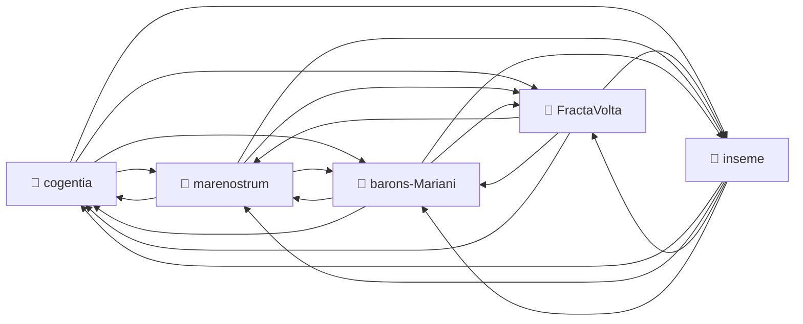

# Corpus Status — barons-Mariani

*Auto-refreshed by `cogentia.js corpus-status`. The structural sections —*
*Registered Repositories, Cross-Reference Graph, Published, What Remains Possible —*
*are regenerated from the registry and from `research/index.md` on every run.*
*The substantive sections — What Is Proved and Open Objections —*
*are manually curated and preserved across refreshes.*

---

## Registered Repositories

<!-- BEGIN_AUTO: registered_repos -->
| Repository | research/index.md | Branch | Last commit |
|---|---|---|---|
| cogentia | ✅ | main | 2026-05-14 |
| FractaVolta | ✅ | main | 2026-05-14 |
| marenostrum | ✅ | main | 2026-05-14 |
| barons-Mariani | ✅ | main | 2026-05-14 |
| inseme | ✅ | main | 2026-05-14 |
<!-- END_AUTO: registered_repos -->

---

## Cross-Reference Graph

<!-- BEGIN_AUTO: graph -->

<!-- END_AUTO: graph -->

---

## Published in this repo

<!-- BEGIN_AUTO: published -->
| Title | Location | Date |
|---|---|---|
| [Discours de la seconde méthode](second_method.md) *(founding methodological doctrine — v1.0)* | this repo | 2026-05-08 |
| [Invidia — envie et désir mimétique](../invidia.md) | this repo | 2026 |
| [Indirect Action Under Mimetic Constraints](../mimetic_desynchronization.md) | this repo | 2026 |
| [Toy Story, AI, and Mimetic Desynchronization — Cultural Strategy for Cognitive Transition](../toy_story.md) *(v6.0)* | this repo | 2026-05-11 |
| [VIGILIA — Distributed avoidance, signalling, and territorial perception (FR)](../vigilia.md) *(v1.3)* | this repo | 2026-05-12 |
| [The Generalized Tocqueville Law — Progress, Rising Expectations, Structural Dissatisfaction](../tocqueville_law.md) | this repo | 2026 |
| [The Republic of Donkeys — A Situated Micro-Experiment in Commons Governance](../the_republic_of_donkeys.md) *(v2.0)* | this repo | 2026 |
| [Markets of Usage Transitions in Multi-Use Physical Assets](../transition_markets.md) | this repo | 2026 |
| [Terrain Configuration Theory for Democratic AI Infrastructure](../terrain_configuration.md) | this repo | 2026 |
| [Possibilism — Notes Toward a Research Program](../possibilism_04_2026.md) | this repo | 2026-04 |
| [Territoires possibilistes — Autonomie alimentaire, diversité épistémique et innovation durable (FR)](territoires_possibilistes.md) | this repo | 2026 |
| [Le Musée uchronique comme dispositif d'inférence historique (FR)](../uchronian_museum.md) | this repo | 2026 |
| [Projet Minesteggio — Fondation Barons Mariani / Musée Uchronique « Napoléon 1821 » (FR)](../projet_minesteggio.md) | this repo | 2026 |
| [Literary Works as Navigable Spaces — AI-Based Cultural Mediation](../ai-based-cultural-mediation.md) | this repo | 2026 |
| [Architecture de l'univers-automate — résolution systémique 2D-4D (FR)](../discret_holography.md) | this repo | 2026-02-27 |
| [Sailing the Cognitive Waves — Stigmergic Cognitive-Terrain Framework](cognitive_waves.md) | this repo | 2026 |
| [Potentics — Toward a Science of the Possible](potentics.md) | this repo | 2026 |
| [Protection responsable](../protection_responsable.md) | this repo | 2026 |
| [Corpus Status](corpus-status.md) *(living view — auto-refreshed by `cogentia.js corpus-status`)* | this repo | refreshable |
<!-- END_AUTO: published -->

---

## What Is Proved

*Manually curated: claims demonstrated by the published work in this corpus.*

| Claim | Status | Evidence |
|---|---|---|
| Public corpus improves via objection integration | ✅ Demonstrated | v0.1→v1.0 git history of `second_method.md`, multiple public AI reviews integrated |
| Machine-readable structure does not degrade human readability | 🔄 In progress | `research/index.md` network navigable; `cogentia.js graph` renders Mermaid |
| Rule 0 boundary documented | ✅ Documented | [DHITL.md Layer 3 / Layer 4 boundary](https://github.com/JeanHuguesRobert/marenostrum/blob/main/DHITL.md) |
| Rule 0 boundary implemented | ❌ Open research problem | No complete technical specification yet |
| Mimetic-desynchronization theory of structural change | ✅ Published | [`mimetic_desynchronization.md`](../mimetic_desynchronization.md) — DRSJ cycle + six mechanisms |
| Generalized Tocqueville Law | ✅ Published | [`tocqueville_law.md`](../tocqueville_law.md) |
| Possibilism research program | ✅ Published | [`possibilism_04_2026.md`](../possibilism_04_2026.md), [`research/potentics.md`](potentics.md) |

---

## Open Objections

*Manually curated: objections received publicly, not yet fully resolved.*

| Objection | Source | Status |
|---|---|---|
| Rule 0 has no complete technical implementation | Grok (v0.4–v0.9 review) | 🔄 Named, partially documented, unresolved |
| MareNostrum chiffres need independent verification | Grok (v0.4–v0.9 review) | 🔄 Documented in repo, awaiting external audit |
| Corpus is solo — fractal claim unproven at scale | Grok (v0.4–v0.9 review) | ❌ Known structural limit — invitation to fork open |
| Claim 4 (transparent infra = AI safety) lacks case study | Grok (v0.7–v0.9 review) | ❌ Weakest claim — empirical test pending |

---

## What Remains Possible

<!-- BEGIN_AUTO: possibilities -->
- Uchronian museology — the Mariani public museum as institutional form
- Casabianca family archive — collateral descent, Battle of Aboukir 1798, WWII submarine
- Generalized Tocqueville Law — formal treatment beyond the aphorism
- Invidia × Ostrom: commons governance as antidote to mimetic capture
<!-- END_AUTO: possibilities -->

---

*Generated with `cogentia.js corpus-status` — [scripts/cogentia.js](https://github.com/JeanHuguesRobert/cogentia/blob/main/scripts/cogentia.js)*
*Challenge via issues. Fork to explore alternatives.*
