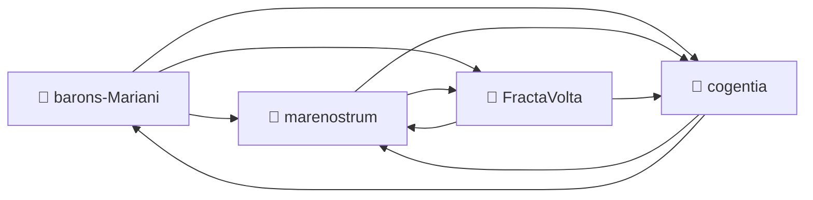

# Corpus Status

*Last updated: 2026-05-08 — automatically updated by `cogentia.js scan`.*

This document maps the current state of the distributed knowledge graph
across all registered repositories. It is the living companion to
[Discours de la seconde méthode](seconde_methode.md).

---

## Registered Repositories

| Repository | research/index.md | Branch | Last commit |
|---|---|---|---|
| [barons-Mariani](https://github.com/JeanHuguesRobert/barons-Mariani) | ✅ | main | 2026-05-08 |
| [marenostrum](https://github.com/JeanHuguesRobert/marenostrum) | ✅ | main | 2026-05-08 |
| [cogentia](https://github.com/JeanHuguesRobert/cogentia) | ✅ | main | 2026-05-08 |
| [FractaVolta](https://github.com/JeanHuguesRobert/FractaVolta) | ✅ | main | 2026-05-08 |

---

## Cross-Reference Graph

---

## What Is Proved

| Claim | Status | Evidence |
|---|---|---|
| Public corpus improves via objection integration | ✅ Demonstrated | v0.1→v1.0 git history, 9 public AI reviews integrated |
| Machine-readable structure does not degrade human readability | 🔄 In progress | research/index.md network navigable |
| Rule 0 boundary documented | ✅ Documented | [DHITL.md layers 4-5](https://github.com/JeanHuguesRobert/marenostrum/blob/main/DHITL.md) |
| Rule 0 boundary implemented | ❌ Open research problem | No complete technical specification yet |
| MareNostrum energy model | 🔄 Proposed | [ARCHITECTURE.md](https://github.com/JeanHuguesRobert/marenostrum/blob/main/ARCHITECTURE.md), [MODEL.md](https://github.com/JeanHuguesRobert/marenostrum/blob/main/MODEL.md) |

---

## Open Objections

*Objections received publicly, not yet fully resolved.*

| Objection | Source | Status |
|---|---|---|
| Rule 0 has no complete technical implementation | Grok (v0.4–v0.9) | 🔄 Named, partially documented, unresolved |
| MareNostrum chiffres need independent verification | Grok (v0.4–v0.9) | 🔄 Documented in repo, awaiting external audit |
| Corpus is solo — fractal claim unproven at scale | Grok (v0.4–v0.9) | ❌ Known structural limit — invitation to fork open |
| Claim 4 (transparent infra = AI safety) lacks case study | Grok (v0.7–v0.9) | ❌ Weakest claim — empirical test pending |

---

## What Remains Possible

*Open Possibilities — ideas that trotte.*

- Independent verification of MareNostrum energy assumptions
- Rule 0 MVP: minimal deployable proof-of-personhood + audit trail
- First external fork of `research/index.md` by an independent researcher
- Empirical test of Claim 1 across two comparable corpora
- `cogentia.js graph` output archived and dated

---

*Generated with `cogentia.js scan` — [scripts/cogentia.js](https://github.com/JeanHuguesRobert/cogentia/blob/main/scripts/cogentia.js)*
*Challenge via issues. Fork to explore alternatives.*
