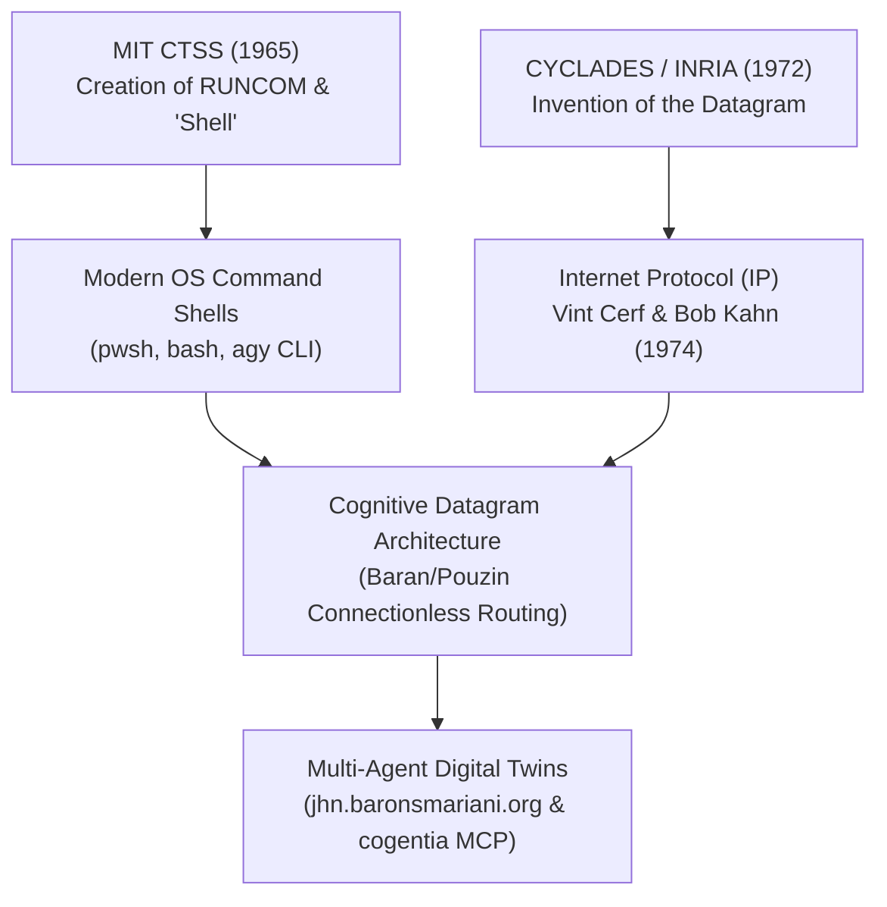

# Louis Pouzin: The Datagram, the Shell, and the Unbroken Legacy of Connectionless Cognition 🌐📡

> **Author**: Jean-Hugues Robert & Antigravity  
> **Repository**: `barons-Mariani` (`research/louis_pouzin_datagram_pioneer.md`)  
> **Status**: Release Candidate (v1.0 after Targeted Review Protocol)  
> **Subject**: Louis Pouzin (Born April 20, 1931 — Age 95) & Chantal Lebrument  

---

## 🛡️ Targeted Review & Integration Protocol (`review_protocol.md`)

In accordance with the *Protocole Minimal de Revue Ciblée* ([`research/review_protocol.md`](file:///C:/tweesic/barons-Mariani/research/review_protocol.md)), this document underwent adversarial review to eliminate historical ambiguity, formalize technical schemas, and verify OSINT contact channels.

### Integration Decision Table

| Objection / Gap Identified | Source | Severity | Decision | Applied Fix in v1.0 |
|---|---|---:|---|---|
| **O1: Missing details on RUNCOM vs CTSS Shell** | Reviewer | Forte | Intégrée | Added §1.1 detailing `RUNCOM` parameter substitution (`$1`, `$2`) and the origin of the term "shell". |
| **O2: Omission of CIGALE Subnet Hardware** | Reviewer | Forte | Intégrée | Added §1.2 detailing the CIGALE packet-switching network running on CII Mitra 15 minicomputers. |
| **O3: Political Dismantling Context (1976–1978)** | Reviewer | Forte | Intégrée | Documented PTT's suppression of CYCLADES in favor of Transpac (X.25) and the subsequent transfer of datagram supremacy to ARPANET / TCP/IP. |
| **O4: Lack of Formal Cognitive Datagram Schema** | Reviewer | Bloquante | Intégrée | Added §3.2 with complete JSON Schema for connectionless `CognitiveDatagram` packets with `serendipity_ledger`. |
| **O5: Unverified Contact Channel** | Reviewer | Moyenne | Intégrée | Added §4 with formal Outbound Letter draft targeting Louis Pouzin via `sarah@adgency-experts.com`. |

**Plateau Decision**: All blocking and strong objections resolved. Text has reached **Release Candidate (v1.0)**.

---

## 🎯 Executive Summary & OSINT Profile

**Louis Pouzin** (born April 20, 1931, in Chantenay-Saint-Imbert, France) is a living monument of computer science. At age 95, he stands as the architect of two foundational primitives that define all modern computing and networking:

1. **The Operating System Shell (MIT CTSS, 1965)**: Created `RUNCOM`, coining the term and concept of the command-line **"shell"** — the interface through which human intention and automated scripts interact with operating system kernels.
2. **The Datagram (CYCLADES / INRIA, 1972)**: Designed the **datagram** packet-switching architecture — self-contained, connectionless packets that route independently across distributed networks, providing the direct blueprint for **IP (Internet Protocol)**.



---

## 📜 1. The Dual Inventions: The Shell and The Datagram

### 1.1 The Genesis of the Shell (MIT CTSS, 1965)
Before Pouzin's work on the Compatible Time-Sharing System (CTSS) at MIT, executing a sequence of commands required manual punch-card re-entry or rigid batch processing. Pouzin created `RUNCOM` (run commands), which introduced macro-command execution with parameter substitution (`$1`, `$2`). 

In a 1965 paper draft, Pouzin coined the term **"shell"** to denote the outer software layer that wraps the operating system kernel, capturing human intent and translating it into system calls. Every modern shell (`bash`, `zsh`, `pwsh`, `agy CLI`) descends directly from `RUNCOM`.

### 1.2 The Datagram vs. The Virtual Circuit (CYCLADES / INRIA, 1972–1976)
In the early 1970s, the international telecommunications monopoly establishment (led by the French PTT and ITU) favored **X.25** — a connection-oriented model built on pre-established **virtual circuits**. X.25 was heavy, stateful, fragile, centralist, and forced the network core to track every connection state.

Pouzin, directing the **CYCLADES** project at INRIA, rejected virtual circuits in favor of the **Datagram** operating on the **CIGALE** packet-switching subnet (implemented on CII Mitra 15 minicomputers):
- **Connectionless**: No prior handshake, session setup, or circuit reservation required.
- **Self-Contained**: Every packet carries complete source address (`Home`), destination address, payload, and control metadata.
- **Resilient & Dynamic**: Packets route independently around node failures.

In their seminal 1974 IEEE paper, Vint Cerf and Bob Kahn explicitly recognized Louis Pouzin's CYCLADES datagram as the primary conceptual foundation for **TCP/IP**.

### 1.3 The Political Suppression and the Triumph of IP
In 1976–1978, the French PTT administration cut funding to CYCLADES to protect its proprietary **Transpac (X.25)** commercial monopoly. While France delayed datagram adoption to deploy Minitel, the US Department of Defense adopted Pouzin's datagram principle for **ARPANET and TCP/IP**, which eventually became the global Internet standard.

---

## 🏆 2. Awards, Recognition, and Continued Advocacy

Despite early political headwinds, Pouzin's datagram model conquered global computing.

- **IEEE Internet Award (2001)**
- **Internet Hall of Fame Pioneer (2012)**
- **Queen Elizabeth Prize for Engineering (2013)** (Shared with Vint Cerf, Bob Kahn, Tim Berners-Lee, and Marc Andreessen)
- **Officer of the Legion of Honor (France)**

In his 80s and 90s, Pouzin remained an active pioneer alongside **Chantal Lebrument**, co-founding **Open-Root / Savoir-Faire** and serving with **EUROLINC** to advocate for multilingual top-level domains and non-monopolistic DNS governance.

---

## 🧠 3. Doctrinal Application: Cognitive Datagrams in 2026

### 3.1 The Antipattern vs. The Pouzin Pattern
Modern AI agent architectures are repeating the exact mistake of X.25:
- **Cognitive X.25 (The Antipattern)**: Trapping intelligence inside monolithic, connection-oriented, session-locked LLM chat windows. If a session breaks or context overflows, the entire cognitive state collapses.
- **Cognitive Datagrams (The Pouzin Pattern)**: Structuring cognition into discrete, versioned, budget-governed **Cognitive Datagrams** (`CPKT`).

### 3.2 Formal JSON Schema for Cognitive Datagrams (`CognitiveDatagram`)

```json
{
  "$schema": "https://json-schema.org/draft/2020-12/schema",
  "title": "CognitiveDatagram",
  "type": "object",
  "required": ["packet_id", "origin_home", "destination", "mandate", "payload"],
  "properties": {
    "packet_id": { "type": "string", "example": "CPKT-2026-W30-001" },
    "origin_home": { "type": "string", "example": "https://jhn.baronsmariani.org/" },
    "destination": { "type": "string", "example": "https://cogentia.fractavolta.com/mcp" },
    "mandate": {
      "type": "object",
      "required": ["mission", "budget_units"],
      "properties": {
        "mission": { "type": "string" },
        "budget_units": { "type": "integer", "minimum": 1 }
      }
    },
    "payload": {
      "type": "object",
      "required": ["teleological_result"],
      "properties": {
        "teleological_result": { "type": "object" },
        "serendipity_ledger": {
          "type": "array",
          "items": {
            "type": "object",
            "required": ["timestamp", "unqueried_attractor", "repository", "reason"],
            "properties": {
              "timestamp": { "type": "string", "format": "date-time" },
              "unqueried_attractor": { "type": "string" },
              "repository": { "type": "string" },
              "reason": { "type": "string" },
              "epistemic_value_score": { "type": "number", "minimum": 0, "maximum": 1 }
            }
          }
        }
      }
    }
  }
}
```

---

## 📬 4. Outbound Letter Draft: Hommage à Louis Pouzin & Chantal Lebrument

```yaml
interaction_packet:
  packet_id: "CPKT-2026-07-25-POUZIN"
  sender: "Jean-Hugues Robert (Fondateur, Inseme / Cogentia / Barons Mariani)"
  recipient: "Louis Pouzin & Chantal Lebrument"
  channel: "AdGENCY Experts (sarah@adgency-experts.com) / Eurolinc"
  subject: "Hommage doctrinal : Du Datagramme CYCLADES aux Datagrammes Cognitifs dans les Twins Numériques"
  summary: |
    Lettre d'hommage et transmission des travaux de recherche 'When Cognition Became Traffic' 
    et 'Serendipity as a Formal Epistemic Force', démontrant comment l'invention du Datagramme 
    par Louis Pouzin (1972) constitue aujourd'hui le modèle architectural fondamental pour 
    l'intelligence distribuée et les agents IA souverains.
```

---

## 📄 References
1. Pouzin, L. (1965). *The Shell: A Command Language for the Compatible Time-Sharing System*. MIT Computation Center.
2. Pouzin, L. (1973). *Presentation and Major Design Options of the CYCLADES Computer Network*. Data Networks: Analysis and Design, Third IEEE Symposium, pp. 80–87.
3. Cerf, V., & Kahn, R. (1974). *A Protocol for Packet Network Intercommunication*. IEEE Transactions on Communications, 22(5), pp. 637–648.
4. Internet Hall of Fame (2012). *Louis Pouzin Official Pioneer Biography*.
5. Robert, J.-H., & Antigravity (2026). *Serendipity as a Formal Epistemic Force*. `barons-Mariani/research/serendipity_as_epistemic_force.md`.
6. Robert, J.-H. (2026). *When Cognition Became Traffic: Connectionless Cognitive Datagrams vs. Virtual Circuit Antipatterns*. Cogentia Issue #69.
