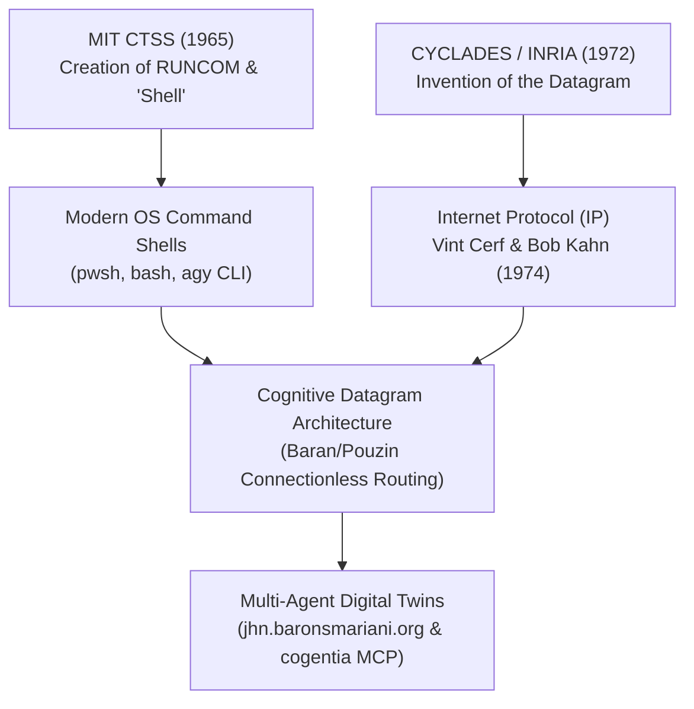

# Louis Pouzin: The Datagram, the Shell, and the Unbroken Legacy of Connectionless Cognition 🌐📡
**An OSINT Academic Profile & Doctrinal Reference**

> **Author**: Jean-Hugues Robert & Antigravity  
> **Repository**: `barons-Mariani` (`research/louis_pouzin_datagram_pioneer.md`)  
> **Date**: July 2026  
> **Subject**: Louis Pouzin (Born April 20, 1931 — Age 95)  

---

## 🎯 Executive Summary & OSINT Profile

**Louis Pouzin** (born April 20, 1931, in Chantenay-Saint-Imbert, France) is a living monument of computer science. At age 95, he stands as the architect of two foundational primitives that define all modern computing and networking:

1. **The Operating System Shell (MIT CTSS, 1965)**: Created `RUNCOM`, coining the term and concept of the command-line **"shell"** — the interface through which human intention and automated scripts interact with operating system kernels.
2. **The Datagram (CYCLADES / INRIA, 1972)**: Designed the **datagram** packet-switching architecture — self-contained, connectionless packets that route independently across distributed networks, providing the direct blueprint for **IP (Internet Protocol)**.

---

## 📜 1. The Dual Inventions: The Shell and The Datagram

### 1.1 The Genesis of the Shell (1965)
Before Pouzin's work on the Compatible Time-Sharing System (CTSS) at MIT, executing a sequence of commands required manual re-entry or rigid batch streams. Pouzin created `RUNCOM` (run commands), which allowed scripts to execute command series automatically. In doing so, he coined the word **"shell"** to denote the outer software layer surrounding the operating system kernel.

### 1.2 The Datagram vs. The Virtual Circuit (1972)
In the early 1970s, the international telecommunications establishment (led by PTT monopolies) favored **X.25** — a connection-oriented model based on pre-established **virtual circuits**. X.25 was heavy, stateful, fragile, and centralist.

Pouzin, heading the **CYCLADES** project at INRIA, rejected virtual circuits in favor of **Datagrams**:
- **Connectionless**: No prior handshake or session setup required.
- **Self-Contained**: Every packet carries complete source, destination, payload, and control metadata.
- **Resilient**: Packets route around node failures dynamically.

Vint Cerf and Bob Kahn explicitly recognized Louis Pouzin's CYCLADES datagram as the foundational inspiration for TCP/IP.

---

## 🏆 2. Awards, Recognition, and Continued Advocacy

Despite political attempts in the late 1970s to dismantle CYCLADES in favor of the French PTT's X.25 / Minitel monopoly, Pouzin's datagram model conquered the global Internet.

- **IEEE Internet Award (2001)**
- **Internet Hall of Fame Pioneer (2012)**
- **Queen Elizabeth Prize for Engineering (2013)** (Shared with Vint Cerf, Bob Kahn, Tim Berners-Lee, and Marc Andreessen)
- **Officer of the Legion of Honor (France)**

In his 80s and 90s, Pouzin remained an active pioneer, co-founding **Open-Root / Savoir-Faire** and serving with **EUROLINC** to advocate for multilingual top-level domains and non-monopolistic DNS governance.

---

## 🧠 3. Doctrinal Application: Why Cognitive Datagrams Matter in 2026

Modern AI architectures are repeating the exact mistake of X.25:
- **Cognitive X.25 (The Antipattern)**: Trapping intelligence inside monolithic, connection-oriented, session-locked LLM chat windows. If a session breaks or context grows too large, the state collapses.
- **Cognitive Datagrams (The Pouzin Pattern)**: Structuring cognition into discrete, versioned, budget-governed **Cognitive Datagrams** (`CPKT`).

Each Cognitive Datagram:
1. Is connectionless and statelessly routable across workstation PCs, VPS nodes, and edge devices.
2. Carries its own origin (`Home`), destination, mandate, and micro-unit budget (COP Kernel).
3. Embeds a **Serendipity Ledger (`serendipity_ledger`)** to log un-queried paths encountered along its route back to `Home`.

---

## 📄 References
1. Pouzin, L. (1973). *Presentation and Major Design Options of the CYCLADES Computer Network*. Data Networks: Analysis and Design, Third IEEE Symposium.
2. Cerf, V., & Kahn, R. (1974). *A Protocol for Packet Network Intercommunication*. IEEE Transactions on Communications.
3. Internet Hall of Fame (2012). *Louis Pouzin Biography*.
4. Robert, J.-H. (2026). *When Cognition Became Traffic: Connectionless Cognitive Datagrams vs. Virtual Circuit Antipatterns*. Cogentia Issue #69.
