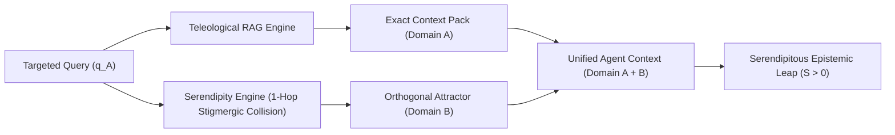

# Serendipity as a Formal Epistemic Force 🎯✨
**Non-Teleological Navigation, Unplanned Attractor Collisions, and the Dynamics of Potentiality ($\Pi$)**

> **Author**: Jean-Hugues Robert & Antigravity  
> **Repository**: `barons-Mariani` (`research/serendipity_as_epistemic_force.md`)  
> **Date**: July 2026  
> **Status**: Academic Paper Draft / Doctrinal Reference  

---

## Abstract

Traditional paradigms of search, retrieval, and optimization are inherently **teleological**: they assume an agent possesses a priori knowledge of the query space and seeks only what is explicitly specified. In contrast, scientific breakthroughs, artistic creation, and complex problem-solving frequently rely on **Serendipity** — defined rigorously here as *the discovery of high-value epistemic attractors that were neither queried nor anticipated*. 

This paper formalizes **Serendipity** ($\mathcal{S}$) as a fundamental epistemic force within **Constructor Theory** (Deutsch & Marletto) and **Potentics**. We introduce a mathematical formulation for Serendipitous Attractor Collisions, contrast teleological search with non-teleological stigmergic exploration, and outline how multi-agent digital twin architectures can explicitly optimize for serendipitous discovery without degenerating into random noise.

---

## 1. Introduction: The Teleological Blindspot

Modern information systems are built on teleological retrieval models:
- **Keyword Search / Vector Similarity**: $f(q) \to \{d_1, d_2, \dots, d_k\}$ maximizes similarity to a prompt $q$.
- **Classical Optimization**: Minimizes cost or maximizes utility over a pre-defined static sample space $\Omega$.
- **Decision Theory**: Evaluates known alternatives under uncertainty.

The fundamental limitation of teleological models is that **they cannot discover what the agent does not already know how to ask for**. When an agent operates exclusively within a teleological query loop, its sample space remains closed ($\Omega_0$). 

**Serendipity ($\mathcal{S}$)** represents the mechanism by which the boundary of the sample space expands ($\Omega_0 \to \Omega_1$). It is not mere randomness; it is the non-linear collision between an ongoing investigative effort ($E$) and an orthogonal, un-queried attractor ($\Gamma_{\text{ortho}}$) that yields an immediate reduction in epistemic entropy.

---

## 2. Formalization within Constructor Theory & Potentics

### 2.1 The Constructor Theory Physical Floor
In Constructor Theory, physics is formulated in terms of which transformations (tasks) are physically **possible** or **impossible**, and which **constructors** (substrates that cause a task and remain ready to repeat it) can exist. 

A binary physical floor dictates whether a task $T: A \to B$ is permitted. However, Constructor Theory does not model the *graded propensity* of an un-actualized task to become real prior to the construction of its constructor.

### 2.2 The Potentic Formulation of Serendipity ($\mathcal{S}$)
Potentics measures potentiality $\Pi$ as a scalar metric:
$$\Pi = \frac{\phi \cdot E}{1 + \sum I}$$

Where:
- $\phi$ is intrinsic propensity under current conditions.
- $E$ is targeted investigative effort.
- $I$ represents inhibitors (resistance to change, organizational friction).

We define **Serendipity ($\mathcal{S}$)** as the differential gain in Epistemic Metapotentiality ($\Pi_e$) generated when effort $E_A$ directed at Task $A$ triggers an unplanned actualization or discovery in Task $B$:

$$\mathcal{S} = \nabla \Pi_B \cdot \text{Collision}\left(\text{Domain}_A, \text{Domain}_B\right)$$

$$\text{where } \text{Collision}\left(A, B\right) = \left\| \Gamma_A \otimes \Gamma_B \right\| > 0, \quad \text{with } q_A \cap q_B = \emptyset$$

Serendipity is non-zero when the coupling tensor between two orthogonal attractor fields ($\Gamma_A, \Gamma_B$) yields actionable epistemic value, despite their initial query vectors ($q_A, q_B$) having zero overlap.

---

## 3. Epistemic Taxonomy: Three Classes of Serendipity

| Class | Mechanism | Example in Monorepo Twin |
|---|---|---|
| **Class I: Linear Serendipity** | Looking for $A$, finding $B$ which directly solves $A$ faster or better. | Searching for REST API routes for authentication, discovering Supabase Vault `instance_config` seeds. |
| **Class II: Structural Serendipity** | Looking for $A$, finding $B$ which reveals that $A$ was the wrong question entirely. | Optimizing float currency counters in Pertitellu, discovering exact-quantity BigInt COP Conformance Kernel. |
| **Class III: Cross-Domain Collision** | Looking for $A$ in Domain $X$, colliding with $B$ in Domain $Y$, spawning synthetic Domain $Z$. | Combining Constructor Theory (Physics) with CADA Legal Acts (`actes`) to create *Procedural Reality Stabilizers*. |

---

## 4. Architectural Incarnation in the Digital Twin

How do we incarnate Serendipity within a multi-repo digital twin architecture (`cogentia`, `inseme`, `ubikia`, `barons-Mariani`) without drowning in noise?



### 4.1 Stigmergic 1-Hop Attractor Cross-Links (`llms.txt`)
Instead of serving strictly hierarchical sitemaps, static projections (`llms.txt` and `llms-full.txt`) expose **1-hop alias cross-links** that bridge orthogonal repositories. An agent navigating `cogentia` MCP tools is exposed to 1-hop attractors from `barons-Mariani` and `inseme`.

### 4.2 High-Signal Un-queried Ingest
The Sunday Corpus Consolidation Runner (`node scripts/cogentia.js consolidate --weekly`) harvests incoming draft notes and `.yaml` interaction packets from `Downloads` and external channels. It filters out noise (invoices, receipts, raw binaries) and highlights unexpected cross-domain collisions in the Weekly Digest.

### 4.3 Cognitive Packet Serendipity Traces (`serendipity_ledger`)
When a **Cognitive Packet** travels from a `Home` node toward a destination under a specific *Letter of Mission*, *Mandate*, and *Budget*, it may encounter un-queried paths or orthogonal attractors during its resolution steps.

Instead of discarding these discoveries, the packet appends a **Serendipity Ledger** (`serendipity_ledger`) to its return payload:

```json
{
  "packet_id": "CPKT-2026-W30-001",
  "origin_home": "https://jhn.baronsmariani.org/",
  "destination": "https://cogentia.fractavolta.com/mcp",
  "mandate": {
    "mission": "Resolve S7 Guide concept Potentics under budget",
    "budget_units": 50
  },
  "teleological_result": { "status": "completed", "attractor": "potentics.md" },
  "serendipity_ledger": [
    {
      "timestamp": "2026-07-25T08:12:00Z",
      "unqueried_attractor": "debord_stabilisateur_procedural.md",
      "repository": "barons-Mariani",
      "reason": "Encountered 1-hop cross-link between Procedural Reality Stabilizers and Informational Gravity during S7 traversal",
      "epistemic_value_score": 0.85
    }
  ]
}
```

When the packet completes its journey and delivers its mission report back to `Home`, both the primary goal output and the serendipitous discovery log are integrated into the corpus memory.

---

## 5. Conclusion & Research Outlook

Serendipity is not an accidental byproduct of human fallibility; it is a **formal epistemic operator** that prevents cognitive engines from becoming trapped in teleological local minima. By formalizing Serendipity within Potentics and embedding 1-hop cross-repo attractor resolution into multi-agent digital twins, we transform serendipitous discovery from a rare accident into a **systematic, repeatable epistemic force**.

---

## References
1. Deutsch, D., & Marletto, C. (2015). *Constructor Theory of Information*. Proceedings of the Royal Society A.
2. Robert, J.-H. (2026). *Potentics: Toward a Science of the Possible*. Corpus Doctrinal Reference.
3. Robert, J.-H. (2026). *When Cognition Became Traffic: Network Taxonomy & MCP Agent Flow*. FractaVolta Research.
4. Robert, J.-H., & Antigravity (2026). *Sunday Corpus Consolidation Master Plan & Dual Digest Pipeline*. Cogentia Issue #70.
